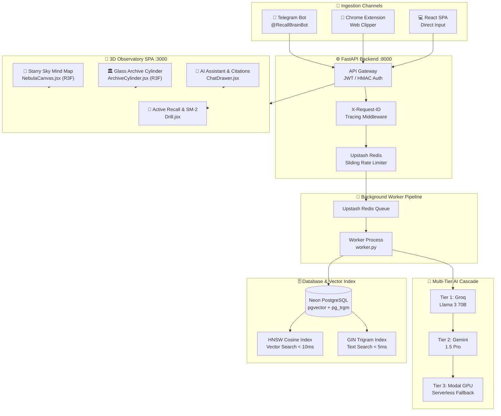
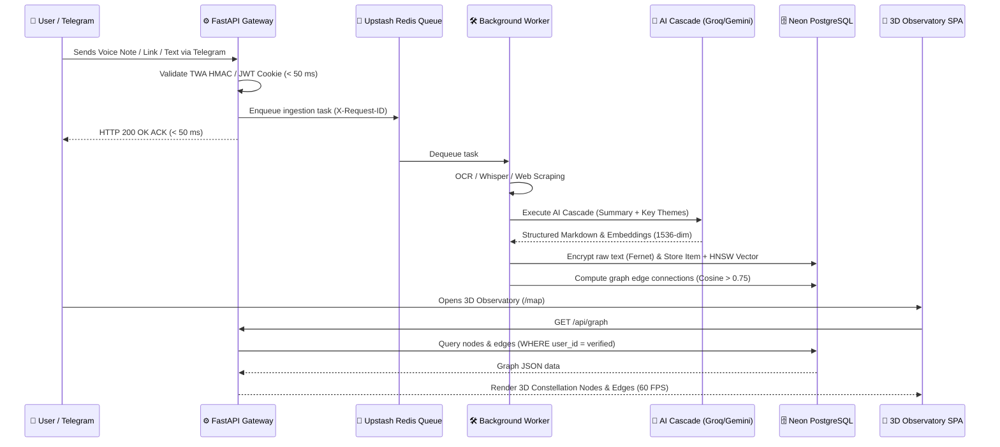
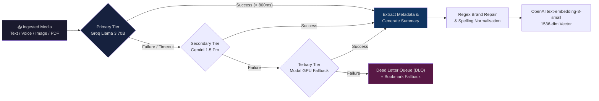

<div align="center">

# ✦ Recall — Personal Knowledge OS & 3D Observatory

*"Your second brain, connected. Forward anything. Find everything."*

---


</div>

---

## 🧭 What is Recall?

**Recall** is a Telegram-first, AI-powered personal knowledge management system presented as a **3D Observatory Environment**. 

Whether it is a voice note recorded on the move, a PDF research paper, an image screenshot, or an Instagram reel — Recall ingests, transcribes, categorizes, embeds, and connects every piece of information into a dynamic, interactive knowledge graph.

---

## 🌟 Comprehensive Feature Set

### 🎨 1. 3D Observatory & Visual Mind Map
* **Starry Sky Mind Map (`NebulaCanvas.jsx` & `MapCanvas.jsx`)**: Real-time 3D and 2D node rendering using Three.js / React Three Fiber at a target 60 FPS, featuring dynamic force-directed layouts, constellation edge lines, node glow flares, and interactive orbital cameras.
* **3D Glass Archive Cylinder (`ArchiveCylinder.jsx`)**: A 3D interactive glass cylinder visualization for browsing memory items with smooth inertia scroll physics and category filters.
* **Observatory Performance Monitor**: Real-time FPS monitoring (`useFPSMonitor.js`) with automatic canvas quality scaling to prevent frame drops on lower-spec hardware.

---

### 🔍 2. Interactive RAG Citations (Camera Auto-Flight)
* **Smart Citation Badges**: AI Assistant answers render clickable citation badges (`[1]`, `[2]`).
* **Auto-Flight Camera Transform**: Clicking any citation badge automatically navigates to the 3D Map view (`/map`), smoothly translates and scales the camera matrix to $k = 1.35$ centered on the cited item, selects the node, highlights adjacent connection lines, and triggers a 3-second golden aura flare ring.

---

### 📥 3. Multi-Format & Multi-Source Ingestion Engine
* **Telegram Bot (`@RecallBrainBot`)**: Ingest text, voice notes, audio files, images, PDFs, URLs, and geographical locations.
* **Voice Note Transcription**: Automated speech-to-text using Whisper for `.ogg`, `.mp3`, `.wav`, and `.m4a` files.
* **Image OCR Preprocessing**: Image contrast enhancement (Pillow 2.0x, grayscale, sharpening) followed by Tesseract OCR text extraction for screenshots and documents.
* **PDF Document Ingestion**: Automatic PDF text extraction via `pdfplumber` / `PyPDF2` chunking with summary and embedding generation.
* **Rich Media & Video Scraping**: Extract YouTube and Instagram reel metadata via Cobalt API with OpenGraph HTML fallback scraping.
* **Chrome Extension & Web Clipper**: Sidepanel popup (`ExtensionPopup.jsx`) and background service worker (`background.js`) for 1-click web clipping and AI tag suggestions.

---

### 🧠 4. Multi-Tier AI Cascade & Resilience
* **Tier 1 — Groq Llama 3 70B**: Primary high-speed LLM processing (< 800 ms latency).
* **Tier 2 — Gemini 1.5 Pro**: Deep reasoning fallback for multi-modal analysis and complex documents.
* **Tier 3 — Modal GPU Serverless**: Cloud GPU execution fallback for heavy Whisper models and custom LLMs.
* **Dynamic Markdown Variants**: Automated selection of prompt templates (Variants A–F) tailored to input types (quotes, articles, code, audio, images).
* **Entity & Brand Repair**: Post-processing regex repair fixing OCR misspellings and brand names.
* **Dead Letter Queue (DLQ)**: Failed processing tasks are safely backed up to a DLQ before fallback bookmarks are saved.

---

### ⏰ 5. Spaced Repetition (SuperMemo SM-2) & Active Recall
* **SuperMemo SM-2 Quiz Engine**: Daily multiple-choice and flashcard quiz generation (`/drill`) using SuperMemo SM-2 scheduling (`interval`, `repetition`, `easiness_factor`).
* **Streak & Accuracy Tracking**: Real-time streak tracking (`StreakBadge.jsx`), quiz accuracy stats, and review history graphs.

---

### 📍 6. Passive Context & Day 1–5 Onboarding
* **Passive Context Ingestion (`compute_passive_context`)**: Passive tracking of user posting frequency, dominant topics, and review habits without manual input.
* **Location Timezone Auto-Detection**: Telegram location updates auto-calculate timezone offset via `round(lon / 15.0 * 2) / 2` and update user preferences.
* **Day 1–5 Onboarding State Machine**: Guided onboarding sequence leading users from bot pairing to their first mind map exploration and active recall quiz.
* **Silent User Re-Engagement**: Automated cron scanner triggering subtle Telegram nudge notifications for dormant users with pending reviews.

---

### 🤝 7. Telegram Thought-Compatibility Game (`/match`)
* **5-Question Compatibility Quiz**: Interactive Telegram command `/match` presenting 5 thought-provoking questions.
* **Referral Link & Synergy Scoring**: Generates custom referral link (`https://t.me/RecallBot?start=match_{user_id}`), matches answers with friends, and calculates tag synergy percentage scores.

---

### ⚡ 8. Search, Retrieval & Security
* **Hybrid Vector & Trigram Search**: HNSW cosine similarity vector search (`< 10 ms`) combined with GIN trigram text search (`< 5 ms`) on Neon PostgreSQL.
* **Command+K Global Finder (`SearchOverlay.jsx`)**: Instant modal search with keyboard shortcuts (`Ctrl+K` / `Cmd+K`), category filtering, and direct node jumping.
* **Security & Encryption**: 100% parameterised SQL queries (zero string interpolation) and Fernet encryption at rest (`gAAAAA...`) for sensitive content and OAuth tokens.

---

## 🏗️ System Architecture



---

## 🔄 Request Lifecycle: Ingestion to 3D Mind Map



---

## 🧠 AI Cascade Flowchart



---

## 📦 Tech Stack

| Layer | Technology | Purpose |
|---|---|---|
| **Backend Framework** | FastAPI (Python 3.11+) | Asynchronous REST API & Telegram Webhook receiver |
| **Frontend Framework** | React 18 + Vite 6 | Single-Page Application with custom hooks |
| **3D Rendering** | Three.js + React Three Fiber | 60 FPS 3D Observatory Mind Map & Glass Archive Cylinder |
| **Database** | Neon PostgreSQL | Managed Postgres with `pgvector` & `pg_trgm` extensions |
| **Vector Index** | HNSW Cosine Similarity | Sub-10ms vector similarity retrieval ($m=16, ef=64$) |
| **Background Queue** | Upstash Redis | Asynchronous ingestion worker queue |
| **AI Processing** | Groq + Gemini + Modal GPU | Multi-tier LLM cascade, Whisper voice, & OCR |
| **Audio Synthesizer** | Web Audio API (`AudioEngine.js`) | Cybernetic room transition & interaction sound effects |
| **Testing Frameworks** | Pytest + Vitest + k6 | Backend unit/integration tests & Frontend component tests |

---

## 🚀 Getting Started

### Prerequisites

- Python 3.11+
- Node.js 18+
- Neon PostgreSQL database instance with `pgvector` enabled
- Upstash Redis account

### 1. Clone Repository

```bash
git clone https://github.com/PriyanshuG27/Recall.git
cd Recall
```

### 2. Backend Setup

```bash
cd backend

# Create virtual environment
python -m venv .venv
.venv\Scripts\activate

# Install dependencies
pip install -r requirements.txt

# Configure environment variables
cp .env.example .env.local

# Run FastAPI backend server
uvicorn backend.main:app --reload --port 8000
```

---

### 3. Frontend Setup

```bash
cd frontend

# Install dependencies
npm install

# Start Vite dev server
npm run dev
```

> 🌐 **App live at** `http://localhost:3000`

---

## 🧪 Testing & Quality Verification

```bash
# Run Backend Pytest Suite (525 Passed, 0 Failed, 62.11% Coverage)
.venv\Scripts\pytest backend/tests/

# Run Frontend Vitest Suite (199 Passed, 0 Failed, 75.26% Coverage)
npm --prefix frontend test

# Run Production Smoke Test
python backend/scripts/smoke_test.py --api-url http://localhost:8000
```

---

## 📚 Technical Documentation

- 🚀 [Deployment & Environment Setup Guide](file:///d:/Recall/docs/DEPLOYMENT.md)
- 🔄 [CI/CD Pipeline Architecture](file:///d:/Recall/docs/CI_CD_PIPELINE_GUIDE.md)
- 🛡️ [Security Scan & Hardening Report](file:///d:/Recall/docs/SECURITY_SCAN_REPORT.md)
- ⚡ [Performance & Load Benchmark Audit](file:///d:/Recall/docs/PERFORMANCE_BENCHMARKS.md)
- 📋 [Manual UI Verification Guide](file:///d:/Recall/docs/MANUAL_VERIFICATION_RECALL_EVOLUTION.md)
- 📖 [Master Prompts Playbook](file:///d:/Recall/docs/PROMPTS_TESTING_DEPLOYMENT_UPDATED.md)

---

<div align="center">

Built with ❤️ for frictionless knowledge capture and 3D exploration.

</div>
