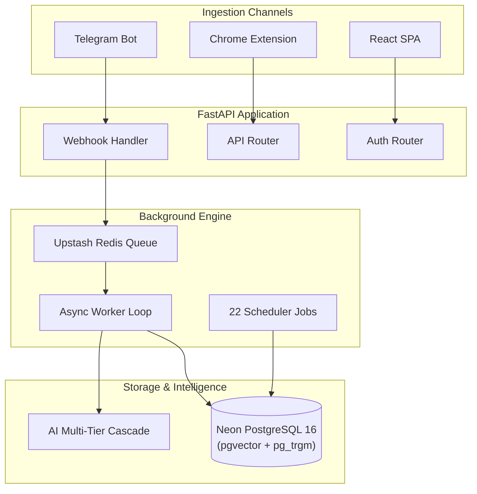

<p align="center">
  <h1 align="center">Recall</h1>
  <p align="center"><strong>Your thoughts deserve more than a graveyard of bookmarks.</strong></p>
  <p align="center">Turn scattered voice notes, articles, PDFs, and screenshots into an interactive 3D spatial knowledge graph you can explore, talk to, and actually remember.</p>
</p>

<p align="center">
  <a href="LICENSE"></a>
  <a href="https://python.org"></a>
  <a href="backend/main.py"></a>
  <a href="frontend/src/App.jsx"></a>
  <a href="backend/db/schema.sql"></a>
  <a href="docs/INDEX.md"></a>
</p>

---

## 🎬 Primary Demo

> [!TIP]
> **Experience Recall**: Send a voice note while walking, bookmark an article on your phone, and clip a technical diagram from your browser—then explore all three inside a living 3D constellation.

<p align="center">
  
  <br>
  <sub><strong>Demo Spec:</strong> 1200x675 MP4/GIF showcasing instant Telegram capture, Three.js 3D graph rendering, and RAG camera auto-flight.</sub>
</p>

---

## 💭 The Problem

We consume dozens of valuable ideas every day:

* A 30-minute technical podcast episode listened to during a morning walk
* A 20-page research PDF saved to a downloads folder
* A code snippet or architecture diagram clipped late at night
* A spontaneous voice thought recorded on a phone

**What happens to them?**

They end up buried in static bookmark folders, forgotten phone screenshots, and unopened browser tabs. 80% of what we save is never seen again. Traditional note apps force you to manually tag, sort into folder hierarchies, and write manual summaries—turning learning into administrative friction.

---

## 💡 The Vision

Recall was built on a simple premise: **Capturing knowledge should take zero effort, and retrieving it should feel like magic.**

Instead of requiring manual organization, Recall processes your raw inputs in the background, extracts core concepts, and maps them mathematically into a **60 FPS 3D spatial constellation**.

When you need an answer weeks later, you don't hunt through folders. You ask Recall in plain English. Your second brain answers with precise sources and **auto-pilots the 3D camera straight to the exact node where that thought lives**.

---

## ☀️ A Day with Recall

> **8:15 AM — Morning Walk**  
> You record a 45-second voice note on Telegram: *"Research how pgvector HNSW index construction parameters impact search latency under concurrency."*  
> *Recall transcribes the audio via Whisper, extracts key technical entities, and embeds the thought in 384-dimensional vector space.*

> **1:30 PM — Lunch Research**  
> You find an insightful technical article on vector indexing while browsing on your laptop. You click the Recall Chrome extension button once.  
> *Recall extracts the page text, generates a concise summary, and connects it to your morning voice note inside the 3D graph.*

> **9:00 PM — Evening Reflection**  
> You open Recall (`/map`) and type into the RAG drawer: *"What did I learn today about vector search optimization?"*  
> Recall responds with a synthesized answer and a citation badge `[1]`. You click `[1]`.  
> *The 3D camera smoothly flies across your constellation, zooming directly onto the node created from your morning voice note.*

> **9:05 PM — Active Retention**  
> You open `/drill`. Recall has automatically generated a flashcard testing your retention of HNSW `ef_construction` parameters. You rate your recall confidence, and SuperMemo SM-2 schedules the next review interval.

---

## 🔄 The Recall Journey

```
  1. CAPTURE    ──► Voice notes, links, or PDFs via Telegram or Chrome Clipper
       │
  2. UNDERSTAND ──► Automated AI summarization, OCR image parsing, and Whisper transcription
       │
  3. CONNECT    ──► 384-dim vector embeddings cluster related thoughts in 3D space
       │
  4. ASK        ──► Conversational RAG with interactive camera auto-flight citation badges
       │
  5. REMEMBER   ──► Active recall flashcards scheduled automatically via SuperMemo SM-2
```

---

## 🖼️ Visual Gallery

| Room / Interface | Spec & Dimensions | Interaction Purpose |
|---|---|---|
| **3D Constellation Map** | 1920x1080 Screenshot (`/map`) | 60 FPS spatial node graph with Louvain community color clusters |
| **Glass Archive Cylinder** | 1920x1080 Screenshot (`/archive`) | 3D glass cylinder browsing with inertia scroll and tag filters |
| **Conversational RAG Drawer** | 800x450 GIF | Clicking citation `[1]` triggers smooth 3D camera flight to cited node |
| **SuperMemo SM-2 Flashcard Room** | 1920x1080 Screenshot (`/drill`) | Active recall testing room with SM-2 interval confidence ratings |
| **Telegram & Chrome Capture** | 800x450 GIF | 1-click web clipping and instant Telegram voice note processing |
| **Cognitive Bridges** | 1920x1080 Screenshot (`/bridges`) | Mind-pairing synergy score visualization and Kintsugi gold decay lines |

---

## ⚡ What Recall Lets You Do

### 📱 Capture Anywhere
> **Zero-friction ingestion without interrupting your flow.**  
> Send voice notes, photos of book pages, PDFs, or article links to your Telegram bot or click the Chrome sidepanel. Powered by Whisper audio transcription, Hugging Face PaddleOCR, and asynchronous Upstash Redis worker queues.

### 🌌 3D Observatory Map
> **Explore your personal universe of thoughts in spatial 3D.**  
> Walk through a spatial 3D graph of your mind (`/map`) or scroll through a glass archive cylinder (`/archive`). Rendered with Three.js and React Three Fiber at 60 FPS using force-directed graph positioning and vector cosine similarity.

### 💬 Conversational RAG & Camera Flight
> **Ask questions and fly directly to the source of your thoughts.**  
> Type a question in plain English. Click a citation badge `[1]` in the answer, and the 3D camera pilots straight to the source item. Driven by Reciprocal Rank Fusion (RRF) combining `pgvector` HNSW cosine search and `pg_trgm` GIN trigram text search.

### 🎴 Spaced Repetition (SuperMemo SM-2)
> **Turn static bookmarks into memories you actually keep.**  
> Review auto-generated flashcards (`/drill`) tailored to your saved content. Rate your recall confidence to space out future reviews using the SuperMemo SM-2 interval algorithm.

### 📝 Obsidian Vault Sync
> **Maintain total ownership over your local data.**  
> Two-way sync your Recall knowledge base with your local Obsidian vault using standard Open Knowledge Format (OKF) Markdown files with YAML frontmatter.

---

## 📊 Traditional Notes vs. Recall

| Experience | Traditional Note Apps | Recall |
|---|---|---|
| **Friction** | Manual titles, tags, and folder organization | Zero-friction capture via Telegram & Chrome extension |
| **Search** | Exact keyword matching only | Hybrid Vector (HNSW) + Trigram (GIN) semantic retrieval |
| **Navigation** | Static lists and nested folders | Interactive 60 FPS 3D spatial constellation map |
| **RAG Answers** | Text-only output | Interactive answer citations with 3D camera auto-flight |
| **Retention** | Saved and forgotten forever | Active recall flashcards scheduled via SuperMemo SM-2 |
| **Security** | Plaintext database storage | Fernet AES-128 cryptographic encryption at rest |

---

## 🏗️ System Architecture



> 📖 *For sequence diagrams, background queue mechanics, and DB schemas, explore the [System Architecture Guide](docs/ARCHITECTURE.md).*

---

## ⚡ Quick Start

Launch Recall locally in under 3 minutes.

### 1. Backend Setup

```bash
git clone https://github.com/PriyanshuG27/Recall.git
cd Recall/backend

# Create virtual environment
python -m venv .venv

# Activate environment (Windows: .venv\Scripts\activate | Linux/macOS: source .venv/bin/activate)
source .venv/bin/activate

# Install requirements & configure env
pip install -r requirements.txt
cp .env.example .env.local

# Start FastAPI server
uvicorn backend.main:app --reload --port 8000
```

### 2. Frontend Setup (Separate Terminal)

```bash
cd Recall/frontend
npm install
npm run dev
```

Open `http://localhost:5173` in your browser.

> 🛠️ *For Makefile targets, test suites, and environment details, read the [Development Guide](docs/DEVELOPMENT.md).*

---

## 📚 Technical Documentation Library

Recall is backed by a complete engineering manual inside `docs/`:

* 🚀 [System Architecture Guide](docs/ARCHITECTURE.md) — System design, sequence diagrams, and lifecycles.
* 🗄️ [Database Reference](docs/DATABASE.md) — DDL schemas, `pgvector` HNSW indexes, and production queries.
* 🔌 [API Reference](docs/API.md) — Complete specification for all 50 FastAPI REST & WebSocket endpoints.
* 🌟 [Feature Status Matrix](docs/FEATURES.md) — Feature status breakdown across production, dev, and legacy code.
* 🛠️ [Development Guide](docs/DEVELOPMENT.md) — Environment setup, `Makefile` targets, and contributor workflows.
* ☁️ [Deployment Guide](docs/DEPLOYMENT.md) — Hosting setup (Koyeb, Vercel, Modal) and 27 environment variables.
* 🛡️ [Security Architecture](docs/SECURITY.md) — Cryptography, Fernet AES-128, HMAC verification, and PII masking.
* 🧪 [Testing Strategy](docs/TESTING.md) — Test pyramid breakdown across 151 test files.
* 🤝 [Contributing Guidelines](docs/CONTRIBUTING.md) — Coding standards, workspace rules, and PR checklist.
* 📊 [Visual Diagrams Collection](docs/DIAGRAMS.md) — 10 code-derived Mermaid diagrams.
* 📋 [Architecture Decision Records (ADRs)](docs/adr/README.md) — Formal records (`ADR-001` through `ADR-006`).

---

## 🤝 Contributing

Contributions are welcome! Please review the [Contributing Guidelines](docs/CONTRIBUTING.md) before submitting pull requests.

---

## 📜 License

Recall is open-source software released under the MIT License.
