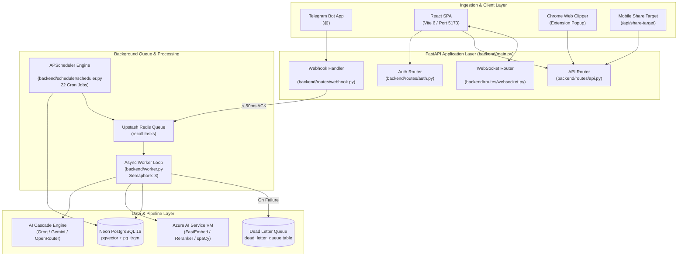
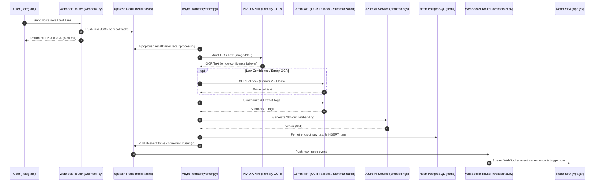
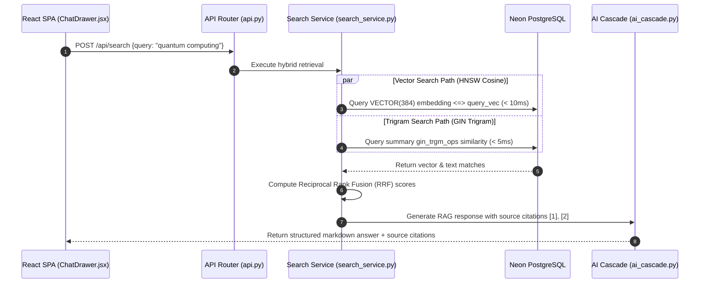

> **Audience**: System Architects, Maintainers, Core Developers  
> **Estimated Reading Time**: 12 min

# Architecture

Recall is a multi-tier personal knowledge OS & 3D Observatory. This document details component responsibilities, ingestion request lifecycles, hybrid search retrieval, and queue architecture.

---

## 1. System Overview & Component Layering

---

## 2. Request Sequence Diagrams

### Ingestion Sequence: Telegram → Queue → Worker → AI → DB → WebSocket

---

### Hybrid Search & RAG Retrieval Sequence

---

## 3. Worker Queue & Concurrency Design

* **Task Queue**: Upstash Redis REST list key `recall:tasks`.
* **Atomic Processing**: Worker uses `brpoplpush("recall:tasks", "recall:processing")` guaranteeing zero task loss on worker crash.
* **Concurrency Semaphore**: `worker_semaphore = asyncio.Semaphore(3)` caps concurrent AI tasks.
* **Dead Letter Queue**: Exceptions write failure payloads to `dead_letter_queue` table ([dlq.py](../backend/services/dlq.py)). Startup lifespan re-enqueues unretried tasks failed < 24h ago.
* **Background Scheduler**: 22 background cron jobs running in APScheduler with `misfire_grace_time=60`.
* **Single-Process Deployment**: In production (Koyeb free tier), the FastAPI web server, background queue worker loop, and APScheduler are consolidated inside a single service container (using `RUN_WORKER_INLINE=true`) to run at low RAM footprint (~150-300 MB) without sacrificing asynchronous task execution.

---

← [Index](INDEX.md) | [Database](DATABASE.md) →

## Related Documentation

[README](../README.md) · [Index](INDEX.md) · **Architecture** · [Database](DATABASE.md) · [API](API.md) · [Features](FEATURES.md)  
[Development](DEVELOPMENT.md) · [Deployment](DEPLOYMENT.md) · [Security](SECURITY.md) · [Testing](TESTING.md) · [Contributing](CONTRIBUTING.md) · [Diagrams](DIAGRAMS.md) · [ADRs](adr/README.md)
