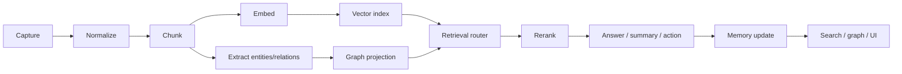

# Recall Architecture Overview

## Current shape
Recall already has the right skeleton:
- FastAPI backend
- PostgreSQL as the source of truth
- pgvector and pg_trgm for hybrid search
- Redis queue/worker processing
- OCR and transcription support
- custom AI routing/cascade boundary
- knowledge layer concepts such as items, chunks, hubs, and bridges

The question is not whether Recall has architecture. It does. The question is whether the architecture is disciplined enough for production.

## Target shape

## Core layers
### Capture
Sources like PDFs, images, screenshots, voice notes, web links, markdown, email, and YouTube transcripts enter the system here.

### Normalize
Every source must become a shared internal representation. Without this, each file type becomes special-case logic forever.

### Chunk
Chunking should become intentional, not just a token split.

### Embed
Embeddings are for semantic access, not for knowledge by themselves.

### Extract
Entities and relationships are the bridge from retrieval to graph intelligence.

### Retrieve
Hybrid retrieval should choose from dense, sparse, metadata, and graph candidates.

### Rerank
Reranking is one of the highest-leverage improvements for answer quality.

### Memory
Not every retrieved fact should become long-term memory. Memory needs policy.

### Graph
Graph is where Recall becomes closer to a knowledge system than a search box.

## What should remain custom
- AI cascade routing
- Recall-specific knowledge model
- memory policy
- graph schema and traversal logic
- analytics schema
- logging policy
- privacy policy

## What can be borrowed from libraries
- document parsing
- output validation
- retrieval helpers
- reranking models
- observability tooling
- memory helpers
- workflow orchestration when necessary

## What should not change too early
- database-first architecture
- custom cascade boundary
- hybrid retrieval core
- existing queue/worker model

## Design goal
Use libraries to remove edge-case burden, not to outsource Recall's identity.
