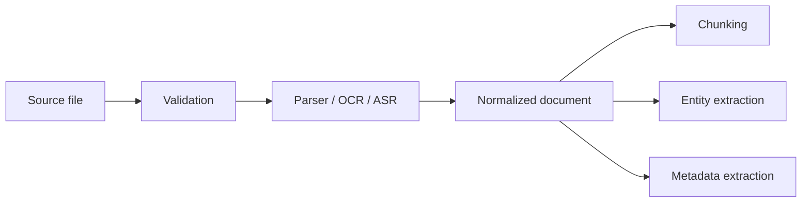

# Ingestion and Document Understanding

## The real problem
Recall does not just need to store files. It needs to understand them enough to extract durable knowledge.

A document pipeline should preserve:
- content
- structure
- metadata
- provenance
- sensitivity
- extractable entities
- relationships
- visual layout clues when relevant

## Current and target role of ingestion
The ingestion layer should convert every supported source into one normalized internal format before downstream processing.

## Current limitations
The main weakness of many AI knowledge systems is that they flatten everything too early. If a PDF contains headings, tables, footnotes, and sections, a naive chunker destroys the document's structure.

## What the pipeline should do

### 1. Validate
- file type
- size
- attachment safety
- malformed input
- archive bombs
- image decompression risk

### 2. Parse
Depending on the source:
- PDF parsing
- DOCX parsing
- HTML parsing
- Markdown parsing
- email parsing
- transcript parsing
- image OCR
- audio transcription

### 3. Normalize
Output a shared document shape with:
- title
- source
- source type
- extracted text
- sections
- blocks
- page references
- tables
- media references
- confidence
- sensitivity flag

### 4. Preserve structure
Keep hierarchy where possible:
- document
- section
- subsection
- paragraph
- table
- figure caption
- note
- transcript segment

## Where Unstructured fits
Unstructured is a candidate for the parser/partitioning step. Its value is not in replacing Recall's architecture; its value is in reducing file-format edge cases.

## When custom logic is better
Custom handling is still better for:
- Recall-specific metadata
- source-specific enrichment
- sensitivity classification
- branching context
- downstream normalization to Recall's own schema

## Ingestion migration strategy
1. Keep current ingestion path working.
2. Add a normalized document layer.
3. Route supported formats through the new layer.
4. Keep fallback handling for weird cases.
5. Measure parse quality and failures.
6. Replace brittle file-specific logic as it becomes redundant.

## What good looks like
After ingestion, a document should be ready for:
- semantic chunking
- parent-child retrieval
- graph extraction
- memory extraction
- safe AI processing
- search indexing

## Priority
This is one of the highest-value improvements after shipping the stable core.
