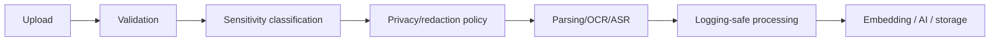

# Security and Privacy

## Why this matters
Recall can accept arbitrary user content. That means it will eventually receive sensitive documents, credentials, personal notes, and confidential work artifacts.

## Already present in the repo
- encrypted raw text storage for some content
- encrypted refresh tokens
- secure cookie handling
- secret masking in some logging paths
- user isolation in core access paths
- deletion cleanup for some derived artifacts

## What is missing or weak

### 1. Sensitive content classification
There is no strong, explicit classification system for uploads or items.

### 2. AI privacy layer
Content may be sent to external models without a strong policy layer that decides whether redaction or local-only processing is needed.

### 3. Logging safety
Raw document content or model output can leak into logs if logging is not carefully sanitized.

### 4. Redis cache privacy
Plaintext raw content in cache keys is a privacy leak and should be replaced with hashes.

### 5. PII masking
Email and phone masking alone is not enough. More sensitive patterns should be detected.

### 6. Upload validation
There should be explicit checks for file type, size, malformed files, and dangerous archives.

### 7. Export safety
Export should have a clear policy around raw text, encryption, and user consent.

## Sensitive data examples
- identity documents
- financial statements
- medical reports
- credentials and secrets
- chat exports
- personal journaling
- addresses and phone numbers
- internal work documents

## Security pipeline target

## Required protections before production
- avoid logging raw content
- hash cache keys
- detect obvious secrets
- enforce upload validation
- safe deletion of derived data
- prevent cross-user retrieval leakage
- verify backup/restore safety
- ensure all env secrets are real production secrets

## Policy recommendation
Every item should be able to carry a sensitivity level. That allows Recall to decide:
- whether to send it to external AI
- whether to redact it
- whether to export it
- whether to store it in a more restricted way

## What to keep simple for V1
This does not require enterprise compliance tooling. It requires disciplined handling:
- classify
- redact
- restrict
- audit

## What not to overbuild yet
- SOC 2
- HIPAA
- enterprise DLP
- heavy compliance infrastructure

Those are later concerns.
