# CI/CD PIPELINE GUIDE — RECALL

| Field | Value |
|---|---|
| Version | 1.0.0 |
| Date | 2026-07-04 |
| Status | Active Specification |
| Target Stack | FastAPI · React+Vite · Neon PostgreSQL · Upstash Redis · Modal GPU · Render · Vercel |

---

## Architecture Overview

This document specifies the continuous integration, continuous delivery, and post-deployment verification architecture for the **Recall** application.

The pipeline is designed with a **solo-developer, zero-flakiness philosophy**:
1. **Fast, Offline CI**: Unit tests and SAST security scans run in isolated containers without external network dependencies.
2. **Idempotent Migrations**: Database schema updates execute safely prior to traffic cutover.
3. **Modal GPU Synchronisation**: Microservices on Modal GPU automatically deploy alongside backend updates to prevent payload contract mismatches.
4. **Post-Deployment Smoke Test Gate**: Live endpoints, WebSockets, and Telegram Webhooks are validated using [smoke_test.py](file:///d:/Recall/backend/scripts/smoke_test.py).
5. **Automated Rollback**: Deployment failures or smoke test breaches trigger automatic rollbacks.

```mermaid
graph TD
    A[Git Push to main] --> B[Job 1: CI Testing & SAST]
    
    subgraph Job 1: CI Pipeline
        B --> B1[Bandit SAST & Secret Audit]
        B --> B2[pip-audit & npm audit]
        B --> B3[Pytest Unit Tests]
        B --> B4[Vitest Unit Tests]
        B --> B5[Vite Production Build Check]
    end

    B1 & B2 & B3 & B4 & B5 -->|Pass| C[Job 2: Modal GPU Sync]

    subgraph Job 2: AI Microservice Sync
        C --> C1[Modal CLI Deploy: Whisper, Embeddings, LLM]
    end

    C1 -->|Success| D[Job 3: Cloud Deployment & Migration]

    subgraph Job 3: CD Deployment
        D --> D1[Render Backend Deploy via Webhook]
        D1 --> D2[Render Pre-Deploy: make schema Migration]
        D --> D3[Vercel Frontend Auto-Build]
    end

    D2 & D3 --> E[Job 4: Post-Deploy Verification Gate]

    subgraph Job 4: Smoke Test & Telegram Audit
        E --> E1[Poll GET /health until HTTP 200]
        E1 --> E2[Run backend/scripts/smoke_test.py]
        E2 --> E3[Audit Telegram getWebhookInfo]
    end

    E3 -->|Pass - Exit 0| F[Deployment Complete - Live]
    E3 -->|Fail - Exit 1| G[Automated Rollback to Previous Release]
```



---

## Complete GitHub Actions Workflow (`.github/workflows/ci_cd.yml`)

Save the following configuration to `.github/workflows/ci_cd.yml`:

```yaml
name: CI/CD Pipeline

on:
  push:
    branches: [ main ]
  pull_request:
    branches: [ main ]

jobs:
  # =========================================================================
  # JOB 1: Continuous Integration (Tests, SAST, Security Audits)
  # =========================================================================
  ci-testing:
    name: Code Quality & Unit Tests
    runs-on: ubuntu-latest
    steps:
      - name: Checkout Codebase
        uses: actions/checkout@v4

      # Python Setup
      - name: Set up Python 3.12
        uses: actions/setup-python@v5
        with:
          python-version: '3.12'
          cache: 'pip'

      - name: Install Backend Dependencies
        run: |
          python -m pip install --upgrade pip
          pip install -r backend/requirements.txt
          pip install pytest pytest-asyncio bandit pip-audit

      - name: SAST Security Audit (Bandit)
        run: bandit -r backend/ -ll

      - name: Backend Dependency Audit (pip-audit)
        run: pip-audit -r backend/requirements.txt

      - name: Run Backend Unit Tests (pytest)
        run: |
          cd backend
          pytest -v

      # Node.js Setup
      - name: Set up Node.js 20
        uses: actions/setup-node@v4
        with:
          node-version: '20'
          cache: 'npm'
          cache-dependency-path: frontend/package-lock.json

      - name: Install Frontend Dependencies
        run: |
          cd frontend
          npm ci

      - name: Frontend Dependency Audit (npm audit)
        run: |
          cd frontend
          npm audit --audit-level=high

      - name: Run Frontend Unit Tests (Vitest)
        run: |
          cd frontend
          npm run test -- --run

      - name: Compile Production Bundle (Vite Build)
        run: |
          cd frontend
          npm run build

  # =========================================================================
  # JOB 2: Modal GPU Microservices Synchronisation
  # =========================================================================
  modal-sync:
    name: Modal GPU Microservice Sync
    needs: ci-testing
    if: github.ref == 'refs/heads/main' && github.event_name == 'push'
    runs-on: ubuntu-latest
    steps:
      - name: Checkout Codebase
        uses: actions/checkout@v4

      - name: Set up Python 3.12
        uses: actions/setup-python@v5
        with:
          python-version: '3.12'

      - name: Install Modal CLI
        run: pip install modal

      - name: Deploy Modal Microservices
        env:
          MODAL_TOKEN_ID: ${{ secrets.MODAL_TOKEN_ID }}
          MODAL_TOKEN_SECRET: ${{ secrets.MODAL_TOKEN_SECRET }}
        run: |
          modal deploy backend/modal_embed.py
          modal deploy backend/modal_whisper.py
          modal deploy backend/modal_llm.py

  # =========================================================================
  # JOB 3: Deploy & Post-Deployment Verification Gate
  # =========================================================================
  deploy-and-verify:
    name: Deployment & Smoke Test Gate
    needs: modal-sync
    if: github.ref == 'refs/heads/main' && github.event_name == 'push'
    runs-on: ubuntu-latest
    steps:
      - name: Checkout Codebase
        uses: actions/checkout@v4

      - name: Trigger Render Backend Deployment
        run: |
          curl -s "${{ secrets.RENDER_DEPLOY_HOOK_URL }}"

      - name: Poll Health Endpoint Until Active
        run: |
          echo "Polling backend liveness probe..."
          for i in {1..30}; do
            STATUS=$(curl -s -o /dev/null -w "%{http_code}" https://api.yourdomain.com/health || echo "failed")
            if [ "$STATUS" = "200" ]; then
              echo "Backend is online and healthy!"
              exit 0
            fi
            echo "Waiting for server deployment (attempt $i/30)..."
            sleep 10
          done
          echo "ERROR: Backend failed to respond to /health in 5 minutes."
          exit 1

      - name: Set up Python 3.12
        uses: actions/setup-python@v5
        with:
          python-version: '3.12'

      - name: Install Verification Tools
        run: pip install requests websocket-client pyjwt

      - name: Run Smoke Test Suite
        env:
          JWT_SECRET: ${{ secrets.JWT_SECRET }}
        run: |
          python backend/scripts/smoke_test.py --api-url https://api.yourdomain.com

      - name: Audit Telegram Webhook Configuration
        run: |
          WEBHOOK_INFO=$(curl -s "https://api.telegram.org/bot${{ secrets.TELEGRAM_BOT_TOKEN }}/getWebhookInfo")
          echo "Telegram Webhook Info: $WEBHOOK_INFO"
          echo "$WEBHOOK_INFO" | grep -q "https://api.yourdomain.com/webhook" || (echo "ERROR: Telegram webhook URL desynchronised!" && exit 1)

      # Automated Rollback Trigger on Failure
      - name: Trigger Rollback on Verification Failure
        if: failure()
        run: |
          echo "CRITICAL: Smoke test or verification failed! Triggering Render rollback..."
          curl -X POST -H "Authorization: Bearer ${{ secrets.RENDER_API_KEY }}" \
            "https://api.render.com/v1/services/${{ secrets.RENDER_SERVICE_ID }}/deploys" \
            -H "Content-Type: application/json" \
            -d '{"clearCache": "clear"}'
```

---

## Infrastructure Provider Setup

### 1. Render (Backend Web Service)
* **Build Command**: `pip install -r backend/requirements.txt`
* **Start Command**: `gunicorn -w ${WEB_CONCURRENCY:-2} -k uvicorn.workers.UvicornWorker backend.main:app`
* **Pre-Deploy Command**: `make schema` *(runs schema migrations safely before taking incoming user traffic)*.
* **Deploy Hook URL**: Found under Render Dashboard -> Service -> Settings -> Deploy Hook.

### 2. Vercel (Frontend Single Page App)
* **Framework Preset**: Vite
* **Root Directory**: `frontend/`
* **Build Command**: `npm run build`
* **Environment Variables**:
  * `VITE_API_URL`: Set to `https://api.yourdomain.com`
  * `VITE_BOT_USERNAME`: Set to your Telegram bot username.

### 3. Modal GPU (AI Microservices)
* **API Tokens**: Created under Modal Dashboard -> Settings -> API Tokens.
* **Secrets**: Store as `MODAL_TOKEN_ID` and `MODAL_TOKEN_SECRET` in GitHub Secrets.

---

## Resource Constraints & Connection Sizing

| Provider | Resource Tier | Limit / Bound | Sizing Strategy |
|---|---|---|---|
| **Neon PostgreSQL** | Free Tier | Max 10 active connections | `min_size=0, max_size=5` in `connection.py` |
| **Upstash Redis** | Free Tier | Max 10,000 REST requests/day | Sliding window Lua rate-limiting |
| **Render** | Starter/Free | 512 MB RAM | FastEmbed ONNX & Modal GPU offloading |

---

## Test Execution Matrix

| Test Suite | Location | Execution Strategy | Target |
|---|---|---|---|
| **Pytest** | `backend/tests/` | Automated in CI | > 90% Code Coverage |
| **Vitest** | `frontend/src/tests/` | Automated in CI | > 85% Component Coverage |
| **Smoke Test** | `backend/scripts/smoke_test.py` | Automated in CD (Post-Deploy) | 10 Scenarios, Exit Code 0 |
| **Playwright E2E** | `e2e/auth_flows.spec.js` | Manual pre-release | Browser Auth & State Persistence |
| **k6 Load Tests** | `backend/tests/load/` | Manual benchmark runs | Recalibrated Local-to-Cloud Baselines |

---

## Incident Response & Manual Controls

If a build fails or an alert triggers:
1. **View Logs**: Inspect GitHub Actions job logs for the specific failing scenario step.
2. **Run Smoke Test Locally**:
   ```bash
   .venv\Scripts\python backend/scripts/smoke_test.py --api-url https://api.yourdomain.com
   ```
3. **Manual Rollback**: If automatic rollback is disabled, roll back in Render via Dashboard -> Deploys -> Re-deploy older commit.
