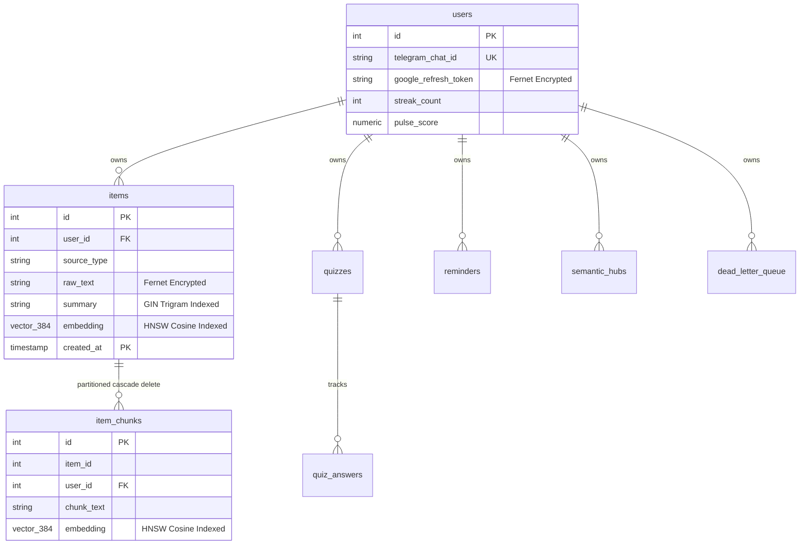

> **Audience**: Database Architects, Backend Developers  
> **Estimated Reading Time**: 8 min

# Database

**Database Engine**: Neon PostgreSQL 16 (Serverless, pooled via `asyncpg`)  
**Extensions**: `vector` (pgvector for ANN vector search), `pg_trgm` (trigram text similarity)  
**Schema Source**: `backend/db/schema.sql`

---

## 1. Schema Inventory (13 Tables)



---

## 2. Core SQL Query Implementation Examples

### Vector Cosine Distance Search (`pgvector` HNSW)
Used in `backend/services/search_service.py` for sub-10ms ANN search:
```sql
SELECT id, summary, 1 - (embedding <=> $1) AS similarity
FROM items
WHERE user_id = $2
ORDER BY embedding <=> $1
LIMIT $3;
```

### Trigram Fuzzy Text Search (`pg_trgm` GIN)
Used in `backend/services/search_service.py` for sub-5ms fuzzy text search on summary:
```sql
SELECT id, summary, similarity(summary, $1) AS sim
FROM items
WHERE user_id = $2 AND summary % $1
ORDER BY sim DESC
LIMIT $3;
```

### Exact Content Hash Deduplication
Used during ingestion to prevent duplicate item processing:
```sql
SELECT id FROM items
WHERE user_id = $1 AND content_hash = $2
LIMIT 1;
```

### High-Speed Reminder Polling Query
Executed minute-by-minute by APScheduler inspecting `idx_reminders_time_status`:
```sql
SELECT id, user_id, message, remind_at
FROM reminders
WHERE status = 'pending' AND remind_at <= $1
ORDER BY remind_at ASC
FOR UPDATE SKIP LOCKED;
```

---

## 3. Table Summary (13 Tables)

* **Base Tables (11)**: `users`, `items`, `quizzes`, `reminders`, `semantic_hubs`, `processed_updates`, `dead_letter_queue`, `item_chunks`, `quiz_answers`, `static_domain_centroids`, `tag_portraits`.
* **Range Partitions (2)**: `items_y2026m06`, `items_y2026m07` (partitioned on `created_at`).

---

## 4. Triggers & Constraints

* **Trigger `trigger_cascade_delete_item_chunks`**: Executes `cascade_delete_item_chunks()` BEFORE DELETE ON `items` FOR EACH ROW to delete associated `item_chunks` records (required because composite partition PK prevents native FK cascading).
* **Fernet Encryption at Rest**: `items.raw_text` and `users.google_refresh_token` encrypted via `backend/services/encryption.py` before `INSERT` / `UPDATE`.


---

← [Architecture](ARCHITECTURE.md) | [API](API.md) →

## Related Documentation

[README](../README.md) · [Index](INDEX.md) · [Architecture](ARCHITECTURE.md) · **Database** · [API](API.md) · [Features](FEATURES.md)  
[Development](DEVELOPMENT.md) · [Deployment](DEPLOYMENT.md) · [Security](SECURITY.md) · [Testing](TESTING.md) · [Contributing](CONTRIBUTING.md) · [Diagrams](DIAGRAMS.md) · [ADRs](adr/README.md)
