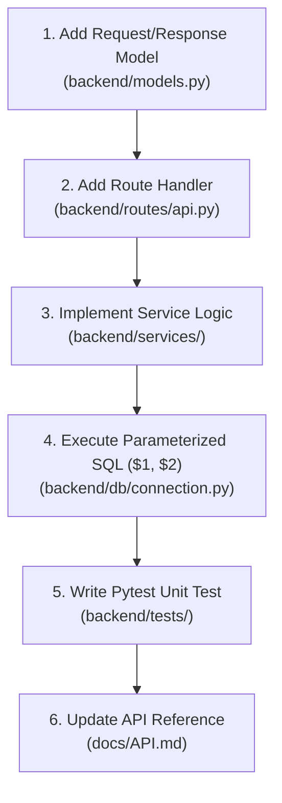
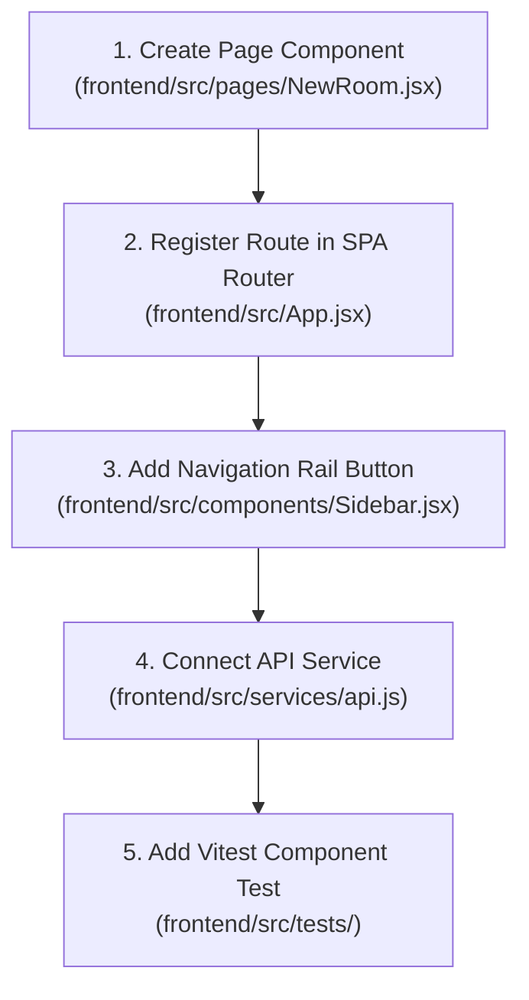
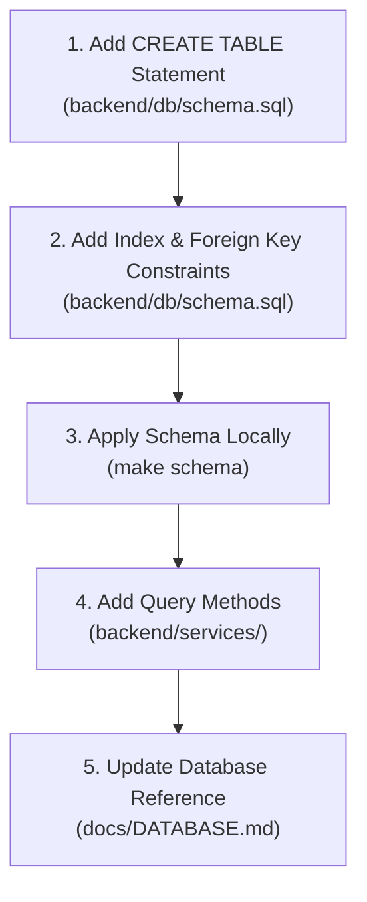
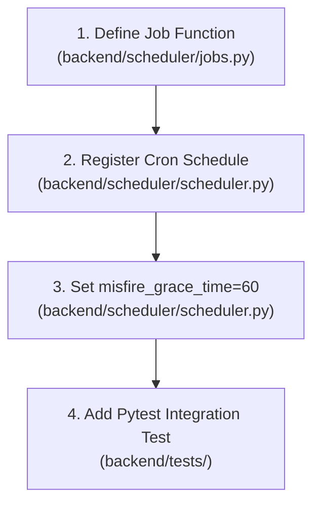

> **Audience**: Contributors, Backend & Frontend Developers  
> **Estimated Reading Time**: 10 min

# Development

This guide covers local environment setup, developer commands, repository layout, debugging, and step-by-step contributor workflows.

---

## 1. Quick Start

```bash
# Backend setup
cd backend
python -m venv .venv

# On Windows:
.venv\Scripts\activate
# On Linux / macOS / Git Bash:
source .venv/bin/activate

pip install -r requirements.txt

> [!IMPORTANT]
> **PaddleOCR Version Requirements:**
> To guarantee local OCR compatibility, install the following specific versions of the Paddle libraries:
> - `paddlepaddle==3.2.1` (or `paddlepaddle-gpu` if GPU is available)
> - `paddleocr==3.4.1`
> - `paddlex==3.4.3` (automatically installed as a dependency of `paddleocr`)
> Using these versions is required as the result parser in `ocr_service.py` is configured to handle the PaddleX dictionary output format.

cp .env.example .env.local
uvicorn backend.main:app --reload --port 8000
```

```bash
# Frontend setup (separate terminal)
cd frontend
npm install
npm run dev
```

---

## 2. Developer Commands (`Makefile`)

| Command | Action | Description |
|---|---|---|
| `make dev-backend` | `uvicorn main:app --reload --port 8000` | Start FastAPI backend in reload mode |
| `make dev-frontend` | `cd frontend && npm run dev` | Start Vite frontend dev server (port 5173) |
| `make schema` | `python init_schema()` | Run database schema initialization on Neon PostgreSQL |
| `make test` | `cd backend && pytest -x -v` | Execute Pytest backend test suite |
| `make fernet` | `python -c "...Fernet.generate_key()"` | Generate a fresh Fernet AES-128 key |
| `make jwt-secret` | `python -c "...secrets.token_hex(32)"` | Generate a fresh 32-byte hex JWT secret key |
| `make tunnel` | `ngrok http 8000` | Create public ngrok tunnel for Telegram testing |

---

## 3. Contributor Workflows

### Workflow 1: Add a Backend API Endpoint



* **Files to Edit**: `backend/models.py`, `backend/routes/api.py`, `backend/services/*.py`.
* **Files to Avoid**: Never write raw string interpolation into database queries.
* **Tests to Update**: Add test module in `backend/tests/test_*.py`.
* **Docs to Update**: Add endpoint entry in `docs/API.md`.

---

### Workflow 2: Add a Frontend Page / Room



* **Files to Edit**: `frontend/src/pages/NewRoom.jsx`, `frontend/src/App.jsx`, `frontend/src/components/Sidebar.jsx`.
* **Tests to Update**: `frontend/src/tests/NewRoom.test.jsx`.
* **Docs to Update**: Add feature description in `docs/FEATURES.md`.

---

### Workflow 3: Add a Database Table



* **Files to Edit**: `backend/db/schema.sql`, `backend/services/*.py`.
* **Common Mistakes**: Forgetting `ON DELETE CASCADE` foreign keys or unparameterized queries.
* **Docs to Update**: `docs/DATABASE.md`.

---

### Workflow 4: Add a Scheduler Job



* **Files to Edit**: `backend/scheduler/scheduler.py`.
* **Mandatory Rule**: Always set `misfire_grace_time=60` on `add_job` calls.

---

## 4. Debugging & Troubleshooting

* **Backend Server**: Run `make dev-backend` and check `http://localhost:8000/health`.
* **Database Connection**: Ensure `DATABASE_URL` uses SSL (`?sslmode=require`).
* **Task Queue**: Check Redis task queues via `GET /api/admin/queue` (`X-Internal-Key` header).

---

## 5. Pre-PR Checklist

- [ ] `make test` completes with zero failures.
- [ ] `cd frontend && npm test` completes with zero failures.
- [ ] Database queries use parameterized `$1, $2` placeholders.
- [ ] Sensitive raw text is Fernet encrypted before DB insertion.
- [ ] Documentation updated in `docs/`.


---

← [Features](FEATURES.md) | [Deployment](DEPLOYMENT.md) →

## Related Documentation

[README](../README.md) · [Index](INDEX.md) · [Architecture](ARCHITECTURE.md) · [Database](DATABASE.md) · [API](API.md) · [Features](FEATURES.md)  
**Development** · [Deployment](DEPLOYMENT.md) · [Security](SECURITY.md) · [Testing](TESTING.md) · [Contributing](CONTRIBUTING.md) · [Diagrams](DIAGRAMS.md) · [ADRs](adr/README.md)
