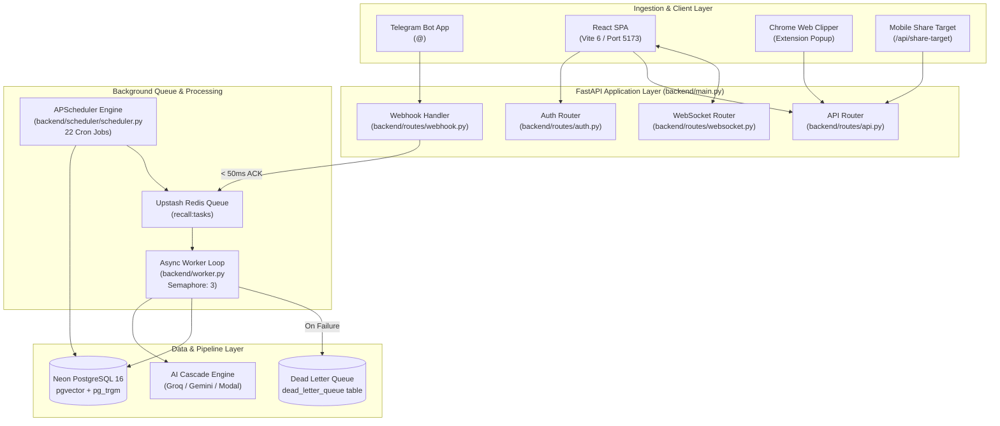
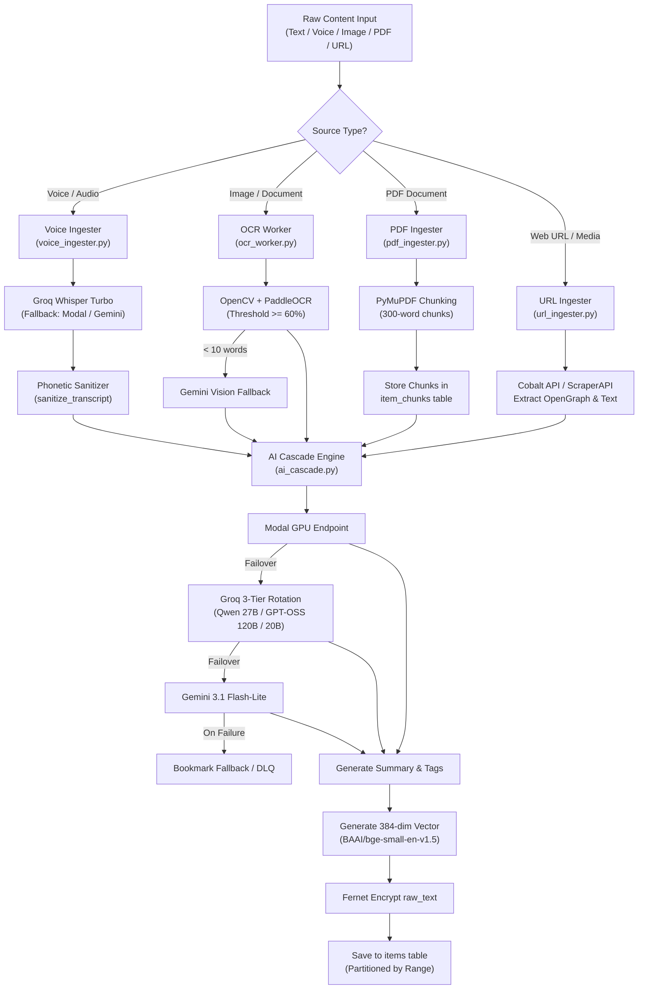
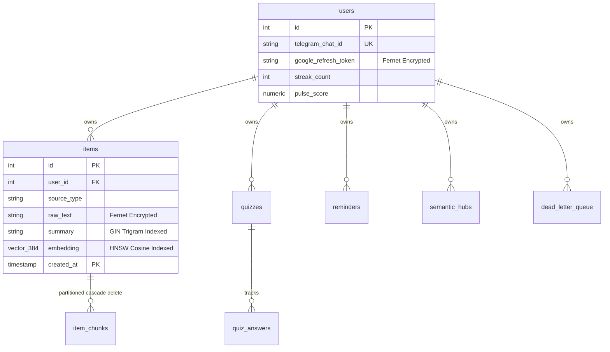

> **Audience**: System Architects, Developers, Reviewers  
> **Estimated Reading Time**: 7 min

# Diagrams

This document serves as the visual reference repository containing all **10 verified Mermaid diagrams** for **Recall**.

---

## 1. System Architecture Diagram
*(Explains overall multi-tier client, API router, worker queue, database, and AI cascade interaction)*

---

## 2. Content Ingestion Pipeline Diagram

---

## 3. Database Entity-Relationship Diagram

---

← [Testing](TESTING.md) | [ADRs](adr/README.md) →

## Related Documentation

[README](../README.md) · [Index](INDEX.md) · [Architecture](ARCHITECTURE.md) · [Database](DATABASE.md) · [API](API.md) · [Features](FEATURES.md)  
[Development](DEVELOPMENT.md) · [Deployment](DEPLOYMENT.md) · [Security](SECURITY.md) · [Testing](TESTING.md) · [Contributing](CONTRIBUTING.md) · **Diagrams** · [ADRs](adr/README.md)
