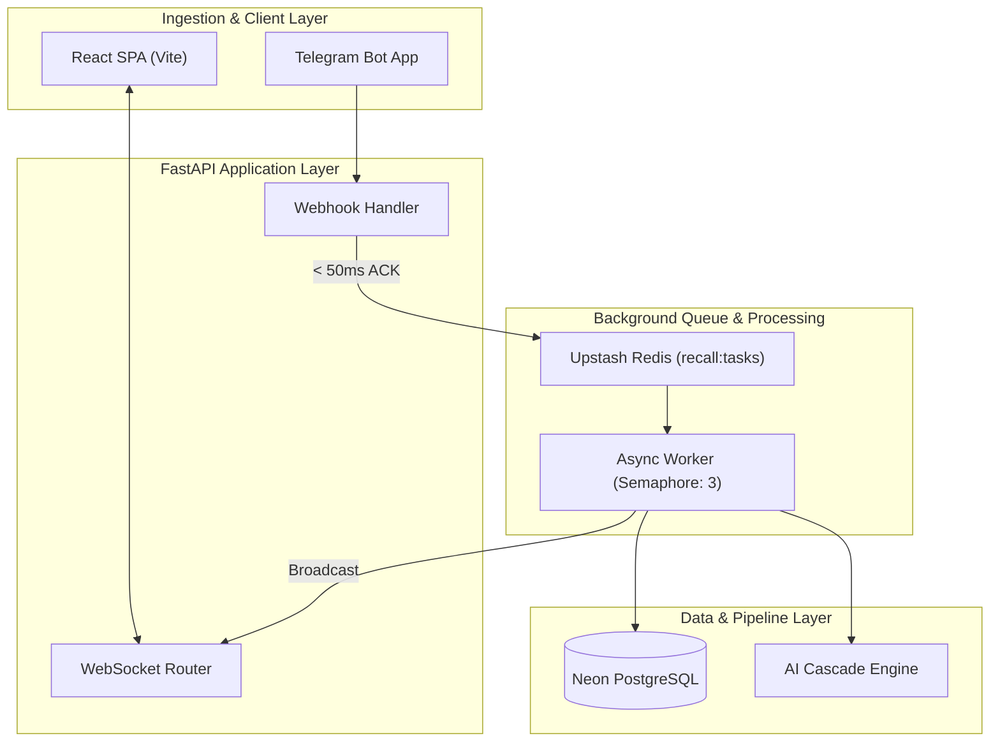

# Chapter 1: Core System Architecture & Concurrency Design

## 1. Introduction
Recall is an AI-first personal knowledge operating system designed to act as a user's second brain. This chapter defines the foundational system architecture, encompassing the web application, API layer, asynchronous background processing, database schemas, and strict concurrency controls. This architecture provides the structural skeleton upon which all ingestions, retrieval, and AI executions depend. It ensures that the system can process unpredictable loads safely without exhausting external AI provider rate limits or dropping messages.

## 2. Current Recall implementation
The current architecture relies on a Fast-API driven backend (`backend/main.py`) paired with a Neon Serverless PostgreSQL database (version 16 with `pgvector` and `pg_trgm`). Client requests enter via Telegram webhooks or a React SPA (Vite 6). Webhooks return a 200 ACK within < 50ms and offload processing tasks to an Upstash Redis queue (`recall:tasks`). The background worker (`backend/worker.py`) polls this queue and orchestrates the item's ingestion and AI Cascade execution, using an `asyncio.Semaphore(3)` to cap concurrent AI tasks. Real-time updates are pushed back to the client via WebSockets. The system runs 22 background cron jobs via APScheduler. 

## 3. Problems
*   **Decoupled Worker Scaling:** The existing architecture ties the worker and the FastAPI web server to similar lifecycles in local dev, which complicates scaling workers independently of the web tier.
*   **Duplicate Instantiation:** `AICascade` is instantiated repeatedly within individual API routes (e.g., in `backend/routes/api.py` and `backend/worker.py`), wasting memory and preventing unified state.
*   **Queue Durability:** While `brpoplpush` provides atomicity, the worker relies on a basic exception catch to push failed jobs to the `dead_letter_queue` table. Hard crashes (OOM kills) might leave tasks stuck in `recall:processing`.
*   **Duplicate WebSocket Endpoints:** Connections are split between `/api/ws` and `/ws/{token}`, causing duplicate broadcasting logic and disconnected auth schemes.

## 4. Design Goals
*   **Zero Task Loss:** Ensure no user data is lost during ingestion spikes or worker restarts.
*   **Strict Concurrency Boundaries:** Cap outbound LLM requests strictly at 3 concurrent threads to respect provider rate limits and contain cloud costs.
*   **Synchronous Web, Asynchronous Heavy-Lifting:** Guarantee sub-50ms HTTP webhook acknowledgments to Telegram.
*   **Database as the Source of Truth:** Do not fragment critical state across transient queues or memory arrays.

## 5. Architecture
Recall utilizes a multi-tier gateway design.
*   **Client Layer:** Telegram Webhook, React SPA, Mobile Share Target, and Chrome Extension.
*   **Gateway Layer:** FastAPI routers isolating `auth.py`, `api.py`, `bridges.py`, `webhook.py`, and `websocket.py`.
*   **Queueing Layer:** Upstash Redis lists for ephemeral task queueing (`recall:tasks`).
*   **Worker Layer:** Async polling worker executing bounded concurrency operations and an APScheduler engine for cron jobs.
*   **Persistence Layer:** Neon PostgreSQL handling relational data, pgvector embeddings, and trigram text indices. 

## 6. Data Flow
1.  **Ingest:** A user forwards a note to the Telegram Bot.
2.  **ACK:** `backend/routes/webhook.py` validates the payload, pushes a JSON representation to the `recall:tasks` Redis queue, and immediately returns HTTP 200.
3.  **Dequeue:** `backend/worker.py` loops on `brpoplpush("recall:tasks", "recall:processing")`.
4.  **Execute:** The worker acquires the `asyncio.Semaphore(3)` and triggers the AI Cascade orchestration.
5.  **Persist:** Text is Fernet-encrypted, vectorized, and written to the `items` PostgreSQL table.
6.  **Broadcast:** The worker publishes an event to Redis channel `ws:connections:user:{id}`.
7.  **Notify:** `backend/routes/websocket.py` receives the Redis event and streams a `new_node` payload to the React SPA.

## 7. Diagrams

## 8. Interfaces
*   **Task Interface:** Worker payloads must conform to the JSON schema: `{ "type": "ingest", "source": "telegram", "user_id": int, "content": str, "metadata": dict }`.
*   **AI Cascade Boundary:** `AICascade.summarise(task_payload)` serves as the explicit programmatic boundary between the worker and the black-box AI logic.

## 9. Database Changes
*   **Dead Letter Queue:** `dead_letter_queue` table captures failed tasks.
*   **Schema Requirement:** Partitioning on `items` table using `created_at` mandates special cascading deletion handling via triggers rather than native foreign keys for dependent chunk tables.
*   No new tables are required specifically for concurrency changes in this design.

## 10. Folder Structure
*   `backend/main.py`: Application entry point and router assembly.
*   `backend/worker.py`: Background worker and concurrency semaphores.
*   `backend/routes/`: FastAPI router implementations.
*   `backend/db/`: Database connection pooling and schema definitions.
*   `backend/scheduler/`: APScheduler cron definitions.

## 11. API Changes
*   **Deprecation:** `/ws/{token}` is marked for deprecation. All WebSocket connections must migrate to `/api/ws` utilizing a unified authentication method.
*   **Singleton Cascade:** The API route handlers will no longer instantiate `AICascade()` internally. They will import a shared instance to minimize memory footprint.

## 12. Migration Strategy
1.  **Phase 1:** Instantiate `AICascade` as a global singleton in `backend/dependencies.py` and inject it into all FastAPI routers and the worker.
2.  **Phase 2:** Merge `/ws/{token}` into `/api/ws`. Update the React frontend to point exclusively to the unified route.
3.  **Phase 3:** Introduce an active heartbeat to the `recall:processing` queue to gracefully recover tasks stuck due to worker OOM crashes.

## 13. Rollback Strategy
If the singleton injection fails or causes lock contention:
1.  Revert the import in routers to instantiate local `AICascade` instances per request.
2.  Maintain both WebSocket routes temporarily to prevent client disconnection.

## 14. Performance
*   **Webhook Latency Target:** < 50ms absolute ceiling.
*   **Worker Throughput:** Bound strictly to 3 concurrent intensive operations (via `asyncio.Semaphore(3)`). This prevents CPU starvation and API throttling.
*   **WebSocket Fan-out:** Must broadcast to specific user channels (`ws:connections:user:{id}`) rather than global broadcast to maintain O(1) event routing.

## 15. Failure Modes
*   **Redis Unavailability:** Webhooks will block or 500 error, forcing Telegram to retry later. This is preferred over data loss.
*   **Provider Rate Limits:** Caught by the AI Cascade, which will fail the task, writing the exact payload to the PostgreSQL `dead_letter_queue` table.
*   **Worker Crash (OOM):** The task remains in `recall:processing`. Startup routines on reboot will re-enqueue items from the processing list back to the active list.

## 16. Security Considerations
*   **Denial of Service:** Concurrency semaphores prevent abusive users from spinning up infinite LLM threads.
*   **Webhook Forgery:** Webhooks must strictly enforce `hmac.compare_digest()` using the Telegram Bot API Secret Token. Unauthenticated pushes are prohibited.
*   **Memory Isolation:** The queue payloads must never contain raw unencrypted sensitive information if Redis is hosted externally; however, since tasks are processed immediately and deleted, ephemeral storage is acceptable.

## 17. Complexity Analysis
*   **Time Complexity:** Enqueueing a task is O(1). Execution is bounded by external API latencies O(N) where N is provider response time.
*   **Space Complexity:** Redis memory usage scales linearly O(T) with uncompleted tasks T. Peak loads require small payloads (reference pointers) rather than gigantic base64 binaries in the queue.

## 18. Tradeoffs
*   **Strict Concurrency vs. Throughput:** Capping the semaphore at 3 limits throughput during traffic spikes, meaning note processing may be delayed. This tradeoff is explicitly chosen to preserve data integrity and prevent cloud billing explosions.
*   **Polling vs. Pub/Sub for Workers:** `brpoplpush` polling introduces a slight idle cycle CPU overhead compared to strict pub/sub, but provides critical task durability.

## 19. Alternatives Considered
*   **Celery/RabbitMQ:** Rejected. Adds immense architectural overhead. Redis is already utilized for rate limiting and cache, minimizing infrastructure bloat.
*   **LangGraph for Pipelines:** Rejected. Recall's orchestration is intentionally built within the custom Cascade to preserve the domain-specific knowledge model.

## 20. Final Recommendation
Maintain the current Redis list queue design with `brpoplpush`. Enforce the 3-task concurrency semaphore. Consolidate API and Worker dependencies to utilize a single global `AICascade` instance to minimize instantiation overhead.

## 21. Implementation Checklist
*   [ ] Refactor `AICascade` to a global singleton.
*   [ ] Consolidate WebSocket routes to `/api/ws`.
*   [ ] Implement a worker startup hook to re-enqueue orphaned tasks from `recall:processing`.
*   [ ] Validate webhook `hmac.compare_digest()` logic exists on all ingest vectors.

## 22. Future Improvements
*   Implement priority queues (e.g., `recall:tasks:high`, `recall:tasks:low`) to prioritize real-time user searches over background scraping.
*   Introduce OpenTelemetry tracing across the queue boundary if microservices are split.

## 23. Version
1.0.0

## 24. Priority
P0 - Critical Core Infrastructure

## 25. Estimated Engineering Effort
3 Developer Days (primarily refactoring existing singletons and unifying WebSocket endpoints).
