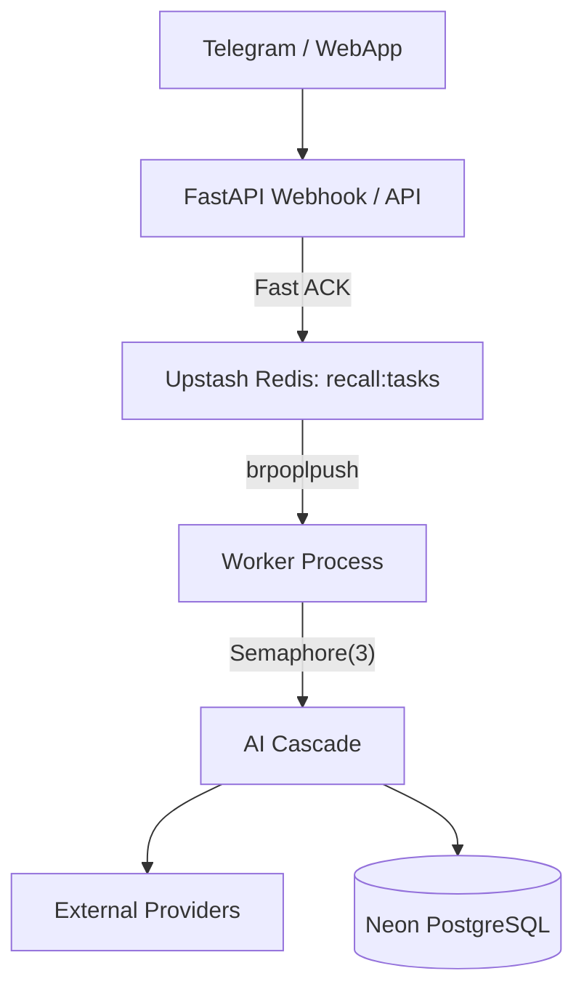
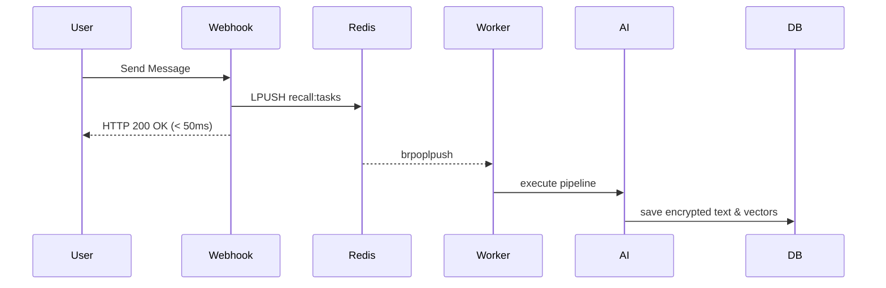

# Current Recall Architecture Baseline (00_CURRENT_RECALL)

**Purpose:** This document freezes the exact state of the Recall architecture as it exists today. It contains zero redesigns, future plans, or aspirational goals. It is the definitive baseline.

---

## 1. Project Vision
Recall is an AI-first personal knowledge operating system designed to act as a user's second brain. It focuses on deep document understanding and semantic retrieval over simple text storage.

## 2. Current Stack
*   **Backend:** FastAPI (Python)
*   **Frontend:** React SPA (Vite 6)
*   **Database:** Neon PostgreSQL (with `pgvector` and `pg_trgm`)
*   **Cache & Queue:** Upstash Redis
*   **Background Jobs:** APScheduler (Cron), custom async polling workers
*   **AI Infrastructure:** Groq, Gemini (via custom AI Cascade orchestration)

## 3. Current Architecture
A decoupled multi-tier system where the API tier handles ingestion and the background worker tier handles LLM execution. They communicate exclusively via Redis lists (`recall:tasks`).

## 4. Backend
*   Powered by FastAPI.
*   Entry point at `backend/main.py`.
*   Routes are logically separated (`auth.py`, `api.py`, `bridges.py`, `webhook.py`, `websocket.py`).
*   Webhooks strictly return HTTP 200 within 50ms, offloading work to Redis.

## 5. Frontend
*   React Single Page Application built on Vite.
*   Connects to backend via REST API and WebSockets for real-time updates.

## 6. Database
*   Relational and Vector data stored together in PostgreSQL.
*   `items` table is partitioned by `created_at`.
*   Uses `pgvector` (HNSW indices) for dense vector search.
*   Uses `pg_trgm` (GIN indices) for fuzzy text search.

## 7. Worker System
*   Operates in `backend/worker.py`.
*   Uses `brpoplpush` to atomically pop from `recall:tasks` into `recall:processing`.
*   Executes heavy operations under a strict `asyncio.Semaphore(3)` concurrency cap to avoid exhausting API limits.

## 8. AI Cascade Boundary
*   The AI logic is encapsulated in `backend/services/ai_cascade/`.
*   It is treated as a strict black box by the rest of the application.
*   Consists of `facade.py` (entry point), `planner.py` (model selection), and `engine.py` (execution and retries).

## 9. Retrieval
*   Executes parallel queries: HNSW vector similarity on `item_chunks` (using 384-dimensional MiniLM-L6-v2 embeddings) and trigram text search on `items.summary`.
*   Results are interleaved using naive Reciprocal Rank Fusion (RRF) before being passed to the RAG LLM.

## 10. Knowledge Graph
*   Currently aggregates semantically similar items into `semantic_hubs`.
*   Uses a `cognitive_bridges` table to define synergies across users.
*   Entity and relation edge extraction is *partially defined but not fully materialized* as rigid graph edges.

## 11. Memory
*   Memory relies on ad-hoc clustering heuristics during ingestion.
*   There is no unified "User Memory Profile" table distinctly typing facts vs. episodic history.

## 12. OCR
*   Image payloads are routed to an external OCR API provider.
*   Extracted text is treated uniformly as raw text by downstream chunks.

## 13. Speech
*   Audio payloads (e.g., voice notes) are passed to a transcription service (Whisper API).
*   Output is dumped directly into the item's `raw_text` field.

## 14. Storage
*   Ephemeral items (tasks) live in Upstash Redis.
*   Durable state (user data, encrypted text, vectors) lives entirely in Neon Serverless PostgreSQL.
*   `raw_text` is encrypted at rest using Fernet AES-128.

## 15. API
*   RESTful JSON endpoints.
*   Authentication via JWT (Cookies) and Telegram Webhook HMAC (`compare_digest`).

## 16. Deployment
*   Deployed on PaaS platforms (Vercel for frontend, Render/Koyeb for backend workers and API).

## 17. Folder Structure
```text
backend/
├── db/            # Schema, migrations, pooling
├── routes/        # FastAPI endpoints
├── services/
│   ├── ai_cascade/# Core Orchestration
│   └── (others)   # Legacy handlers
├── main.py        # API Entry
└── worker.py      # Background Execution
```

## 18. Current Strengths
*   **Fast Webhooks:** Decoupled ingestion ensures the Telegram bot never hangs.
*   **Hybrid Search:** Combining vector and trigram search provides robust baseline retrieval.
*   **Unified Persistence:** Keeping relational data and vectors in Postgres simplifies backups and transactionality.

## 19. Current Weaknesses
*   **Duplicate Instantiation:** `AICascade` is instantiated repetitively, bloating memory footprint.
*   **Fragmented Processing:** `Quiz`, `Insight`, and `RAG` endpoints bypass the main `ExecutionEngine` and its circuit breakers.
*   **OOM Vulnerability:** Crashed worker tasks remain stuck in `recall:processing` without an active heartbeat reaper.

## 20. Known Technical Debt
*   `/ws/{token}` duplicates routing logic of `/api/ws`.
*   `safety.py` and `security/filter.py` contain overlapping regex logic.
*   `PromptAnalyticsManager` aggregates cost data in local memory, which is lost on worker restart.

## 21. Current Scalability
*   The system scales horizontally via Redis. Multiple worker instances can safely pop from `recall:tasks`.
*   PostgreSQL connections are the primary scaling bottleneck (requires external PgBouncer or Neon's native pooling).

## 22. Current Bottlenecks
*   Worker throughput is hard-capped by `Semaphore(3)`. Spikes in traffic result in delayed processing rather than crashing.
*   PDF ingestion flattens structures, leading to suboptimal chunking on large documents.

## 23. Current Production Readiness
*   **Functional:** Yes.
*   **Resilient:** Partially (circuit breakers are bypassed for many operations).
*   **Observable:** No. Lack of structured logging (`structlog`) and trace IDs makes debugging production errors difficult.

## 24. Current Diagrams

### Current Architecture & Data Flow


### Current Sequence Diagrams

**Ingestion Sequence:**


## 25. Current Database Responsibilities
*   **`users`**: Core auth and `google_refresh_token` (encrypted).
*   **`items`**: Partitioned table containing `raw_text` (encrypted), `summary`, and basic metadata.
*   **`item_chunks`**: Foreign-keyed text chunks and 384-dimension `embedding` column for HNSW index.
*   **`semantic_hubs`**: Derived clusters linking multiple items.
*   **`telemetry_cost_logs`**: Ledger of token costs (partially implemented).

## 26. Current Interfaces
*   **AI Cascade Facade:** `summarise(payload: dict) -> SummaryResult`
*   **Webhook Payload:** `{ "type": "ingest", "source": "telegram", "user_id": int, "content": str, "metadata": dict }`
*   **Database Search:** `search_items(query: str, filters: dict) -> List[Chunk]`
