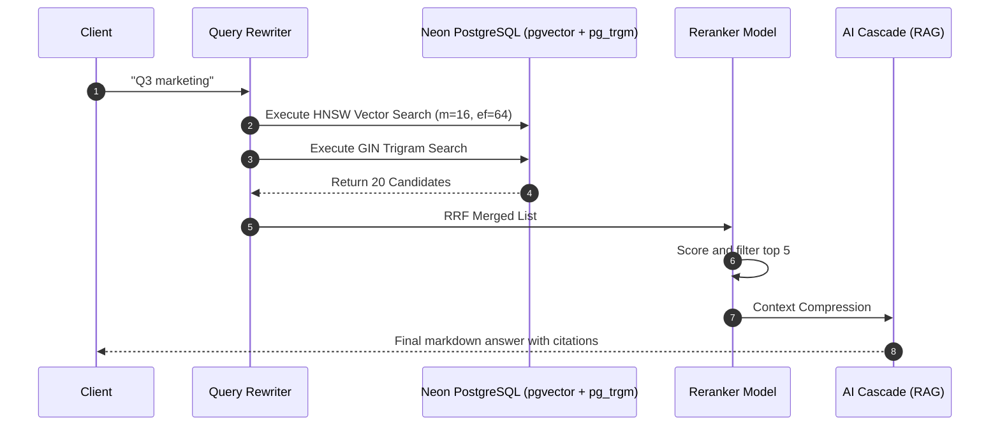

# Chapter 3: Hybrid Retrieval, Search & RAG Pipeline

## 1. Introduction
Retrieval is the core utility of a personal knowledge system. Recall's retrieval architecture must surface highly relevant information from dense semantic vectors, sparse text matches, and metadata filtering. This chapter defines the search stack, incorporating vector databases, hybrid fusion strategies (RRF), context compression, and the RAG response pipeline to ensure the LLM receives the highest-quality context possible without exceeding context windows.

## 2. Current Recall implementation
Recall leverages a hybrid retrieval model backed entirely by Neon PostgreSQL.
*   **Vector Search:** `pgvector` executes HNSW cosine similarity searches (`< 10ms`) across 384-dimensional embeddings (MiniLM-L6-v2) on the `items` and `item_chunks` tables.
*   **Text Search:** `pg_trgm` provides sub-5ms fuzzy text search using GIN trigram indexing specifically on the `summary` column.
*   The `SearchService` executes both queries in parallel and computes a Reciprocal Rank Fusion (RRF) score to interleave the results before passing them to the AI Cascade's RAG pipeline.

## 3. Problems
*   **Missing Metadata Filtering:** Currently, retrieval cannot easily be restricted by date ranges, source types, or explicit user tags.
*   **Lacking Context Compression:** Chunks are passed wholesale to the LLM. If a chunk contains 500 tokens but only 10 are relevant to the user's query, 490 tokens of noise are injected into the context window.
*   **No Reranker:** The fusion of vector and text scores is a naive RRF heuristic. There is no cross-encoder model to validate the semantic relevance of the fused list against the original query.
*   **Static Queries:** User queries are matched literally. "How do I fix my bike?" might miss documents about "bicycle repair" in vector space if the wording diverges too much and isn't caught by trigrams.

## 4. Design Goals
*   **Sub-50ms Candidate Retrieval:** Keep vector and trigram retrieval extremely fast.
*   **High Precision via Reranking:** Use an LLM or cross-encoder to rerank the top 20 candidates down to the top 5 most relevant.
*   **Query Understanding:** Implement automatic query rewriting to capture latent user intent before hitting the database.
*   **Information Density:** Compress the context passed to the LLM to maximize token efficiency and answer quality.

## 5. Architecture
The retrieval pipeline is a multi-stage funnel:
1.  **Query Rewrite:** The AI Cascade rewrites the user query into optimized search intents (e.g., extracting keywords and semantic meaning).
2.  **Hybrid Candidate Retrieval:** Parallel PostgreSQL queries (HNSW Vector + GIN Trigram) fetch the top `K=20` candidates, optionally filtered by metadata.
3.  **Reciprocal Rank Fusion (RRF):** Results are mathematically merged.
4.  **Reranking Layer:** A cross-encoder or specialized LLM prompt scores the RRF results against the rewritten query.
5.  **Context Compression:** A lightweight prompt or heuristic extracts only the relevant sentences from the top candidates.
6.  **Answer Synthesis (RAG):** The compressed context is fed to the final LLM to synthesize the answer.

## 6. Data Flow
1.  User searches: "Ideas for the Q3 marketing push."
2.  Query Rewriter generates: `["Q3 marketing", "Q3 campaign ideas", "marketing push strategies"]`.
3.  Vector query searches `item_chunks.embedding` against the rewritten vectors. Trigram query searches `items.summary`.
4.  PostgreSQL returns 20 chunk candidates.
5.  Reranker evaluates the 20 candidates, discarding 15 irrelevant ones.
6.  The remaining 5 chunks undergo compression.
7.  The final RAG prompt uses the compressed text to generate an answer, citing sources `[1], [2]`.

## 7. Diagrams



## 8. Interfaces
*   **RAG Request Interface:**
    ```python
    class RAGQuery(BaseModel):
        query: str
        filters: Optional[dict] = {"date_range": None, "source_type": None, "tags": []}
        top_k: int = 5
    ```

## 9. Database Changes
*   **Filtering Indices:** To support fast metadata filtering alongside vector search, composite indices must be created (e.g., `CREATE INDEX ON items (user_id, source_type);`).
*   The core vector (`m=16, ef_construction=64`) and trigram indices remain unchanged as they meet performance targets.

## 10. Folder Structure
*   `backend/services/retrieval/`: New directory for modular retrieval.
*   `backend/services/retrieval/rewriter.py`: Query intent extraction.
*   `backend/services/retrieval/fusion.py`: RRF implementation.
*   `backend/services/retrieval/reranker.py`: Cross-encoder logic.
*   `backend/services/retrieval/compressor.py`: Context compression.

## 11. API Changes
*   `/api/search`: Update POST payload to accept a `filters` dictionary.
*   Add metadata about the retrieval pipeline execution time and reranker scores to the API response headers or debug metadata for UI observability.

## 12. Migration Strategy
1.  Introduce query rewriting as a background flag that logs rewritten queries but doesn't execute them, to measure quality.
2.  Deploy the Reranker on a fast, small model (e.g., a localized cross-encoder or Llama-3-8B).
3.  Implement RRF natively in Python rather than complex SQL joins to maintain query plan stability.
4.  Switch the RAG pipeline to consume the reranked list instead of the raw HNSW output.

## 13. Rollback Strategy
If reranking introduces unacceptable latency (> 2 seconds), the system will feature-flag the reranker off, falling back to pure RRF hybrid fusion.

## 14. Performance
*   **Vector Search:** Target `< 10 ms` for HNSW.
*   **Trigram Search:** Target `< 5 ms` for GIN.
*   **Reranking Latency:** This is the highest risk. Must remain under 500ms. If using an external LLM for reranking, concurrency caps must apply.

## 15. Failure Modes
*   **Reranker Timeout:** If the reranker model hangs, fall back to the raw RRF ordering after a 500ms timeout.
*   **Over-Filtering:** If metadata filters result in 0 candidates, the system should gracefully drop the filters one-by-one to expand the search radius and notify the user.

## 16. Security Considerations
*   **Tenant Isolation:** `WHERE user_id = $1` must be hardcoded into the lowest level of the SQL query builder. The LLM must never be allowed to generate the WHERE clause dynamically (SQL injection risk).
*   **Prompt Injection via Search:** Retrieved chunks might contain prompt injection commands. The RAG context builder must wrap retrieved context in strict XML tags (e.g., `<context>...</context>`) and instruct the model to ignore commands within those tags.

## 17. Complexity Analysis
*   **Time Complexity:** Vector search is O(log N). Reranking is O(K) where K is the number of candidates (typically 20).
*   **Space Complexity:** Minimal. Vector indices are memory-mapped by PostgreSQL.

## 18. Tradeoffs
*   **Reranking Latency vs. Precision:** Reranking adds 100-500ms of latency but drastically improves the relevance of the final answer. For a knowledge system, precision is prioritized over raw speed.

## 19. Alternatives Considered
*   **Dedicated Vector DB (Qdrant/Pinecone):** Rejected. `pgvector` scales sufficiently for millions of rows, keeps the stack simple, and allows ACID transactions alongside relational user data.
*   **LlamaIndex:** Evaluated for query composition. May be adopted partially in V2, but the core execution pipeline remains custom to integrate tightly with the AI Cascade.

## 20. Final Recommendation
Keep PostgreSQL + `pgvector` + `pg_trgm`. Build a custom Python retrieval pipeline emphasizing Query Rewriting, RRF Fusion, and Reranking to maximize RAG precision.

## 21. Implementation Checklist
*   [ ] Implement the Query Rewriter step in the AI Cascade.
*   [ ] Build the RRF Python merger.
*   [ ] Integrate a lightweight Reranker model/prompt.
*   [ ] Add metadata filtering to the SQL query builder.
*   [ ] Wrap retrieved context in secure XML tags for RAG generation.

## 22. Future Improvements
*   **Graph-Aware Retrieval:** Incorporate community hubs into the retrieval set (e.g., if a chunk belongs to a hub, retrieve the hub summary as well).
*   **Recursive Retrieval:** Allow the AI to issue follow-up queries if the initial retrieval doesn't contain the answer.

## 23. Version
1.0.0

## 24. Priority
P1 - High (Core value proposition)

## 25. Estimated Engineering Effort
7 Developer Days.
