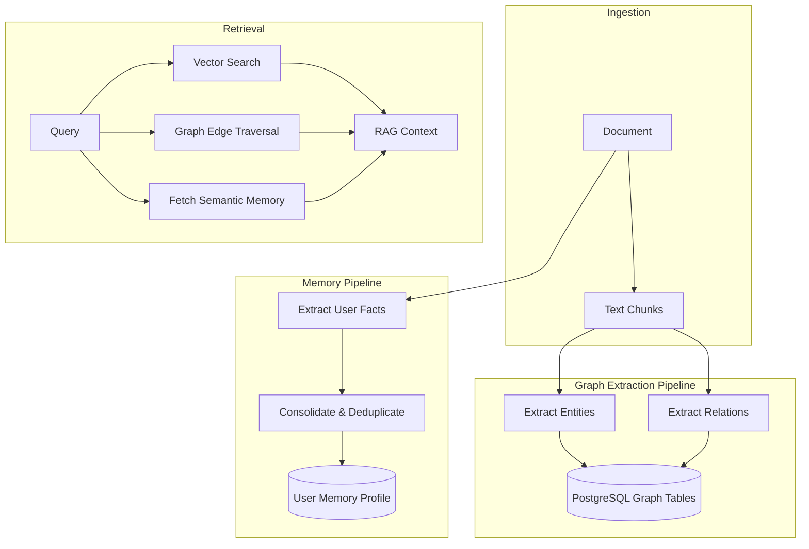

# Chapter 4: Knowledge Graph, Semantic Hubs & Memory

## 1. Introduction
A personal knowledge operating system must transcend simple document search. It must surface latent relationships, summarize thematic neighborhoods, and maintain persistent memory about the user's preferences. This chapter outlines the architecture for moving Recall toward a GraphRAG-style system, defining the extraction, traversal, and memory consolidation policies.

## 2. Current Recall implementation
Recall currently groups related items into `semantic_hubs`. When items share semantic proximity, a background scheduler clusters them, generates a hub label, and stores the mean embedding (centroid) in the `semantic_hubs` table. 
The system also maintains `cognitive_bridges` to map synergies between different users. 
However, entity and edge extraction (true graph architecture) is not fully implemented, and memory policy relies on ad-hoc rules rather than a unified memory management system.

## 3. Problems
*   **Missing Granular Graph:** The system clusters documents (hubs), but does not extract specific entities (e.g., "Company X", "Project Y") or relationships (e.g., "Company X is acquiring Project Y").
*   **Unstructured Memory:** User preferences, facts, and interaction history are not explicitly typed. Stale or duplicate memories can pollute AI context windows.
*   **No Community Summarization:** Hubs group items, but they lack persistent, AI-generated "community summaries" that can be injected into RAG pipelines to provide high-level context.
*   **Database Constraints:** Relational mapping of thousands of dense graph edges in PostgreSQL can become inefficient without careful schema design.

## 4. Design Goals
*   **Entity Extraction:** Automatically identify and catalog entities (People, Organizations, Concepts) from ingested documents.
*   **Relationship Mapping:** Draw semantic edges between entities based on document context.
*   **Typed Memory System:** Segregate memory into Working Memory (current task), Semantic Memory (facts), and Episodic Memory (past interactions).
*   **Graph-Aware Retrieval:** Enhance traditional vector search by traversing graph edges to pull related concepts.

## 5. Architecture
The Graph and Memory layer acts as a continuous background processor.
1.  **Extraction:** During or shortly after ingestion, the AI Cascade extracts entities and relations using structured schemas (e.g., Instructor/Pydantic).
2.  **Projection:** Entities and edges are stored in PostgreSQL (using jsonb or dedicated edge tables).
3.  **Community Detection:** Background jobs cluster entities into thematic neighborhoods (Hubs).
4.  **Memory Consolidation:** Nightly cron jobs review recent user interactions, extract new preferences/facts, and update the user's `mind_type_summary` or dedicated memory tables, aggressively pruning stale facts.

## 6. Data Flow
1.  User ingests a meeting transcript about "Project Apollo".
2.  The ingestion pipeline saves the text.
3.  An async background worker triggers the `GraphPipeline`.
4.  The LLM extracts: Entity A ("User"), Entity B ("Project Apollo"), Edge ("is lead of").
5.  The database writes these nodes and edges.
6.  The Memory pipeline detects a user preference: "User prefers weekly updates on Apollo." This is written to the user's semantic memory profile.
7.  During a future RAG query about "Apollo", the system retrieves the chunks *plus* the semantic memory fact and the connected graph edges.

## 7. Diagrams



## 8. Interfaces
*   **Graph Edge Schema (Pydantic):**
    ```python
    class RelationEdge(BaseModel):
        source_entity: str
        target_entity: str
        relation_type: str
        evidence_chunk_id: int
        confidence: float
    ```

## 9. Database Changes
*   **New Tables:** `entities` (id, user_id, name, type, description) and `edges` (id, user_id, source_id, target_id, relation_type, weight).
*   **Indices:** B-Tree indices on `source_id` and `target_id` to allow fast 1-hop and 2-hop traversals in SQL.
*   **Memory Table:** `user_memory` (user_id, memory_type, content, updated_at).

## 10. Folder Structure
*   `backend/services/graph/`: Extraction and traversal logic.
*   `backend/services/memory/`: Consolidation and pruning rules.
*   `backend/services/ai_cascade/pipelines/graph.py`: The missing pipeline for entity extraction.

## 11. API Changes
*   `/api/graph/neighborhood/{entity_id}`: Fetch 1-hop connections for visual UI rendering (3D Observatory).
*   `/api/user/memory`: Expose the user's current semantic memory profile for transparency and manual editing.

## 12. Migration Strategy
1.  Define the `entities` and `edges` tables in PostgreSQL.
2.  Implement the `GraphPipeline` inside the AI Cascade.
3.  Run a backfill script to process the last 30 days of `items` to populate the initial graph.
4.  Implement 1-hop retrieval in the search service.

## 13. Rollback Strategy
If graph extraction becomes too expensive (token costs) or slows down the workers, disable the async graph extraction flag. The system gracefully degrades to standard vector search.

## 14. Performance
*   **Extraction Cost:** Entity extraction is LLM-intensive. It must run asynchronously and utilize smaller, faster models (e.g., Llama-3-8B) to contain costs.
*   **Traversal Latency:** PostgreSQL recursive CTEs can traverse 1-hop and 2-hop edges in < 20ms if properly indexed. Do not attempt N-deep traversals at query time.

## 15. Failure Modes
*   **Entity Duplication:** "Steve Jobs" and "S. Jobs" might be extracted as separate entities. Resolution: Nightly deduplication cron jobs using vector similarity on entity names.
*   **Memory Pollution:** Incorrect facts extracted from fiction or jokes. Resolution: Allow users to view and delete their memory profile via the UI.

## 16. Security Considerations
*   **Graph Leakage:** All `entities` and `edges` must strictly enforce `WHERE user_id = $1`. An edge must never link entities belonging to different users (unless explicitly utilizing the opt-in `cognitive_bridges` feature).
*   **Memory PII:** The memory profile acts as a concentrated dossier of the user. It requires the same encryption at rest as raw document text.

## 17. Complexity Analysis
*   **Time Complexity:** Graph extraction is O(T) where T is tokens. SQL traversal for 2-hops is O(E) where E is the number of edges connected to the node.
*   **Space Complexity:** Edges scale at O(N^2) in the worst case, but practically O(N) where N is documents, assuming a constant number of relations per document.

## 18. Tradeoffs
*   **PostgreSQL vs. Neo4j:** Storing graphs in relational tables (PostgreSQL) is slightly less ergonomic than a dedicated graph DB like Neo4j, but it prevents the massive operational overhead of managing two separate state stores for V1.

## 19. Alternatives Considered
*   **Neo4j:** Rejected for V1. The graph complexity does not yet justify the infrastructure burden.
*   **Mem0 / Zep:** Rejected for immediate adoption. Recall must define its proprietary memory semantics and policies before outsourcing memory infrastructure to a black-box framework.

## 20. Final Recommendation
Implement Graph extraction and Memory consolidation using custom pipelines writing to PostgreSQL. Focus on 1-hop and 2-hop community retrieval (GraphRAG-lite) rather than deep, complex traversals.

## 21. Implementation Checklist
*   [ ] Create `entities`, `edges`, and `user_memory` SQL schemas.
*   [ ] Wire the `GraphPipeline` inside the AI Cascade.
*   [ ] Build the Memory Consolidation cron job.
*   [ ] Update the 3D Observatory UI to fetch graph edges.

## 22. Future Improvements
*   Adopt Neo4j only if SQL graph queries become a proven bottleneck.
*   Implement global ontological mapping to standardize entity types.

## 23. Version
1.0.0

## 24. Priority
P2 - Medium (Transforms Recall from a search engine into a knowledge engine)

## 25. Estimated Engineering Effort
10 Developer Days.
