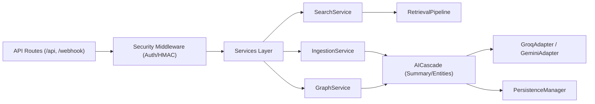
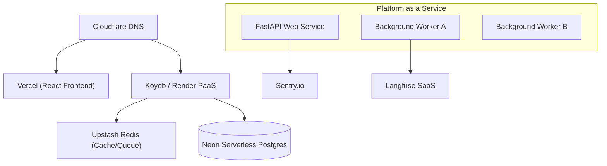
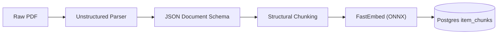
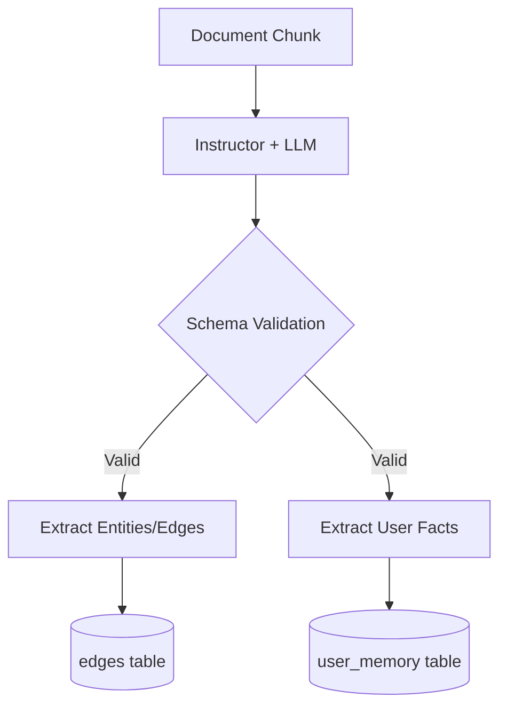
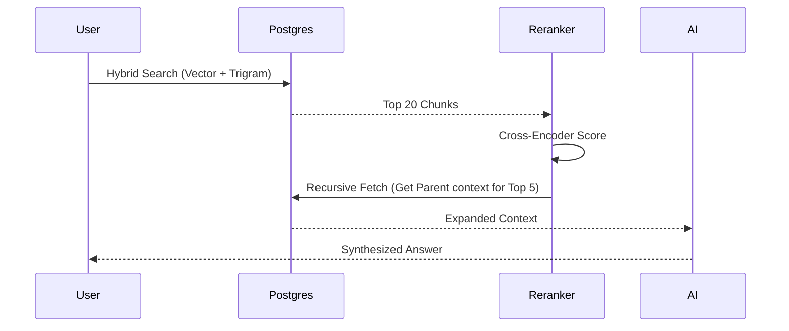
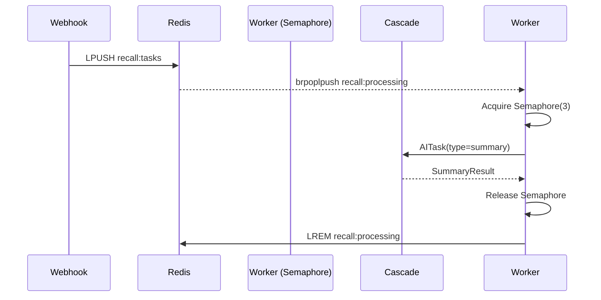
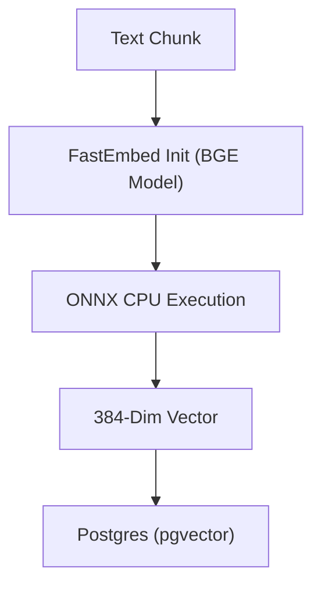
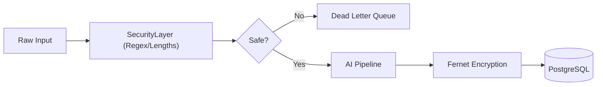
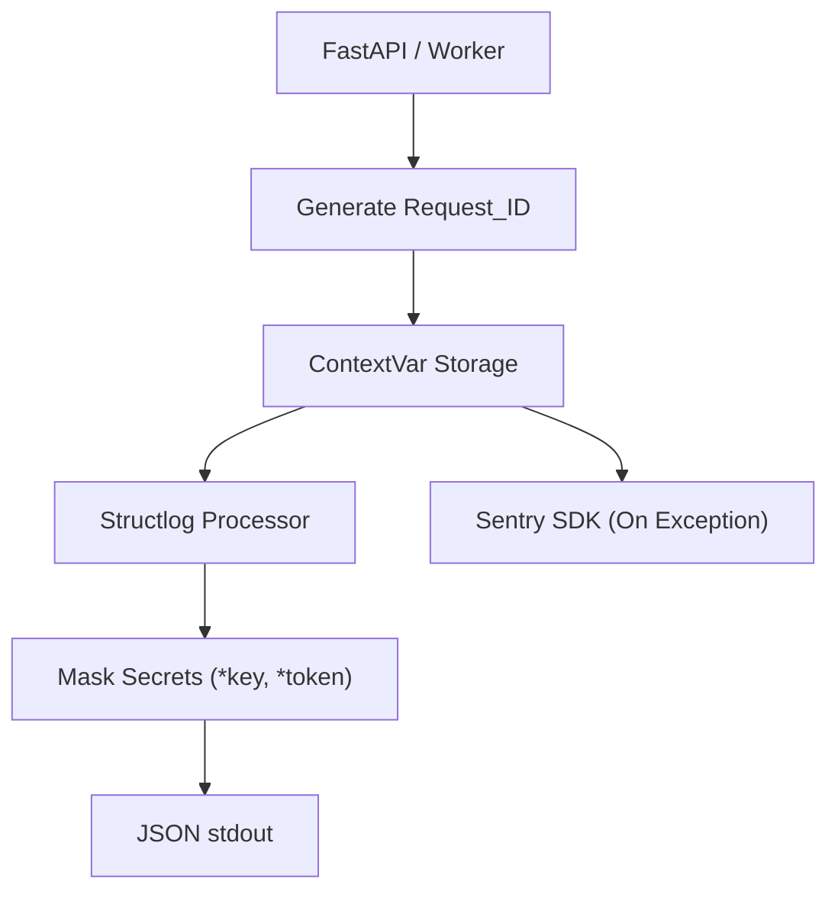
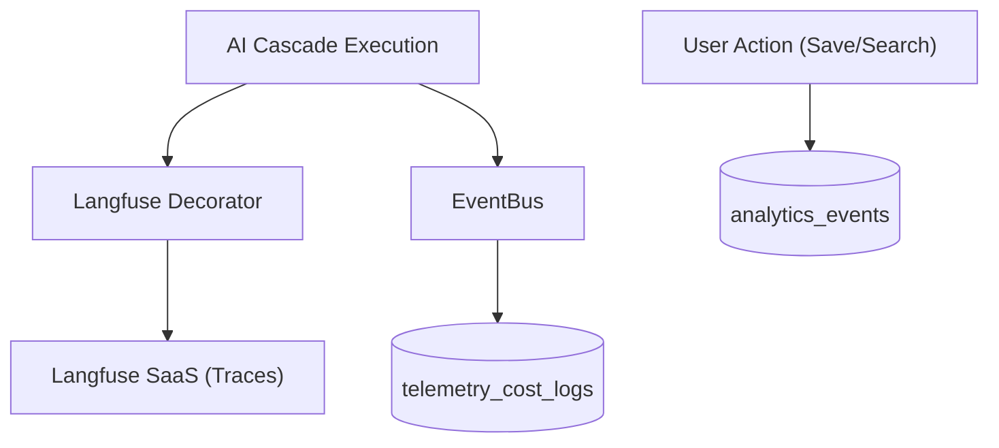

# Target Architecture (04_TARGET_ARCHITECTURE)

**Purpose:** This document defines the definitive future architecture of Recall. It incorporates all approved decisions (Unstructured, Instructor, FastEmbed, GraphRAG principles, Langfuse, Structlog, Sentry, Recursive Retrieval, and Mixedbread Rerankers) while strictly adhering to the immutable AI Cascade boundary and PostgreSQL-centric design.

---

## 1. High-Level Architecture & Components

### Complete Architecture Diagram
```mermaid
flowchart TB
    Client["Client (Telegram / WebApp)"] --> API["FastAPI Gateway"]
    API --> RedisQ["Upstash Redis (Tasks)"]
    
    subgraph Background Workers
        Worker["Async Polling Worker (Semaphore=3)"]
        Cron["APScheduler (Nightly Sync)"]
    end
    
    RedisQ --> Worker
    
    subgraph Ingestion Pipeline
        Unstructured["Unstructured (PDFs/HTML)"]
        FastEmbed["FastEmbed (ONNX Local)"]
    end
    
    subgraph AI Cascade Engine
        Engine["Execution Engine (facade, planner)"]
        Instructor["Instructor (Pydantic validation)"]
        Security["Unified Security Layer"]
    end
    
    subgraph Retrieval Pipeline
        Hybrid["pgvector + pg_trgm"]
        Rerank["Mixedbread Cross-Encoder"]
        Parent["Recursive Parent Retrieval"]
    end
    
    subgraph Observability
        Structlog["Structlog (JSON Stream)"]
        Sentry["Sentry (Exceptions)"]
        Langfuse["Langfuse (LLM Traces)"]
    end
    
    Worker --> Ingestion Pipeline
    Worker --> AI Cascade Engine
    AI Cascade Engine --> LLM["Groq / Gemini APIs"]
    
    API --> Retrieval Pipeline
    Retrieval Pipeline --> DB[(Neon PostgreSQL)]
    Worker --> DB
```

### Component Diagram


### Deployment Diagram


---

## 2. Responsibilities & Structure

### Folder Structure
```text
backend/
├── main.py                     # API Entry & Middleware
├── worker.py                   # Redis Polling & Semaphore limits
├── core/
│   ├── logging.py              # Structlog setup
│   └── telemetry.py            # Langfuse & Sentry init
├── db/
│   └── database.py             # Neon Postgres pooling
├── routes/
│   ├── api.py                  # Standard REST
│   └── webhook.py              # Telegram entry
└── services/
    ├── ai_cascade/             # [BLACK BOX] Core Orchestration
    │   ├── engine.py           # Retry & Execution
    │   ├── facade.py           # AITask boundaries
    │   └── security.py         # Unified PII & Injection filters
    ├── ingestion/
    │   ├── unstructured.py     # PDF/Doc parsing
    │   └── chunking.py         # Parent/Child semantic chunks
    ├── retrieval/
    │   ├── hybrid.py           # RRF Fusion
    │   └── reranker.py         # Mixedbread local reranker
    └── graph/
        └── memory.py           # Fact extraction & GraphRAG updates
```

### Database Responsibilities
*   **`users`**: Authentication, settings, and encrypted tokens.
*   **`items` & `item_chunks`**: Partitioned durable storage of encrypted text. `item_chunks` holds FastEmbed vectors and `parent_id` pointers.
*   **`entities` & `edges`**: Native Postgres Graph storage for GraphRAG relationships.
*   **`user_memory`**: Typed facts (working, episodic, semantic).
*   **`analytics_events`**: Durable product telemetry (searches, saves).
*   **`telemetry_cost_logs`**: Ledger for LLM token usage (populated by Langfuse webhooks or internal EventBus).

### API Responsibilities
*   Sub-50ms Webhook HTTP 200 acknowledgments.
*   Enforce JWT and HMAC authentication.
*   Manage WebSocket connections (`/api/ws`).
*   Inject `request_id` ContextVars for structlog.

### Worker Responsibilities
*   Atomic queue popping (`brpoplpush`).
*   Enforce `asyncio.Semaphore(3)` limit to protect provider accounts.
*   Execute heavy I/O: Unstructured parsing, FastEmbed generation, AI Cascade requests.
## 3. Flows & Logic

### Knowledge & Document Flow (Ingestion)
1. Document arrives via Telegram (e.g., PDF).
2. Saved to `items` table as pending.
3. Worker picks up task. Routes to **Unstructured**.
4. Unstructured parses tables and headings into a JSON Document schema.
5. Chunking splits text, maintaining a `parent_id` linking children back to the main section.
6. **FastEmbed** runs locally, generating BGE vectors.
7. Text and vectors are committed to PostgreSQL.



### Graph & Memory Flow
1. After ingestion, the background worker triggers the `GraphPipeline` inside the AI Cascade.
2. The LLM (via **Instructor** for strict Pydantic schemas) extracts `entities` and `edges`.
3. New facts are evaluated against `user_memory`.
4. Stale facts are pruned; new entities and edges are written to Postgres.



### Retrieval Flow
1. Query Rewrite generates multiple intents.
2. **Hybrid Search**: `pgvector` HNSW (vector) and `pg_trgm` GIN (text) run in parallel.
3. RRF merges results.
4. **Mixedbread Reranker** (local cross-encoder) scores the top 20, keeping the top 5.
5. **Recursive Retrieval**: For the top 5 chunks, their `parent_id` is queried to fetch the surrounding paragraph.
6. Context is passed to RAG.



### Worker & Sequence Flow


### Embedding Flow

## 4. Operations, Observability & Recovery

### Security Flow
1. Webhook validates `X-Telegram-Bot-Api-Secret-Token`.
2. All AI prompts hit the unified `SecurityLayer`.
3. PII is masked via regex.
4. Prompt is wrapped in `<context>` tags to prevent Markdown breakout injections.
5. `raw_text` is encrypted via Fernet AES-128 before writing to PostgreSQL.
6. DB enforces `WHERE user_id = $1` on all queries.



### Logging Flow


### Analytics Flow


---

## 5. Non-Functional Architecture

### Future Scalability
*   **Database:** When Postgres connections become a bottleneck due to worker scaling, deploy **PgBouncer** or rely on Neon's native Serverless Connection Pooling. 
*   **Vectors:** `pgvector` scales to ~10-50M vectors with proper HNSW index tuning. If performance drops above 100M, vector storage will be externalized to Qdrant.
*   **Workers:** Redis `brpoplpush` architecture allows infinite horizontal scaling of worker containers, bound only by the database connection pool.

### Failure Recovery
*   **OOM Reaper:** A new startup hook in the worker inspects `recall:processing`. If a task has been there for >10 minutes (indicating an OOM crash of a previous worker), it is atomically moved back to `recall:tasks`.
*   **Circuit Breakers:** The AI Cascade `RetryEngine` falls back to secondary models (e.g., Llama-3 to Gemini) if the primary API returns 500s or continuous 429s.

### Backup Strategy
*   **Database:** Neon handles Point-in-Time Recovery (PITR) automatically. Full logical dumps via `pg_dump` are scheduled weekly to S3 for offsite disaster recovery.
*   **Secrets:** The `FERNET_KEY` is completely isolated from the database and source code. It is backed up in a secure cold-storage vault. *Losing the Fernet key is the only unrecoverable disaster.*

### Rollback Strategy
*   **Code Rollbacks:** Deployed via immutable Docker tags on Koyeb/Render. Rolling back is an instant traffic shift to the previous tag.
*   **Database Migrations:** Schema changes (e.g., adding `entities` table) are deployed using Alembic. Every `up` migration must have a tested, non-destructive `down` migration.
*   **AI Cascade Changes:** If an LLM degrades significantly in production, model endpoints are controlled via environment variables (e.g., `PRIMARY_MODEL=llama-3.3`), allowing hot-swaps without a code deployment.
