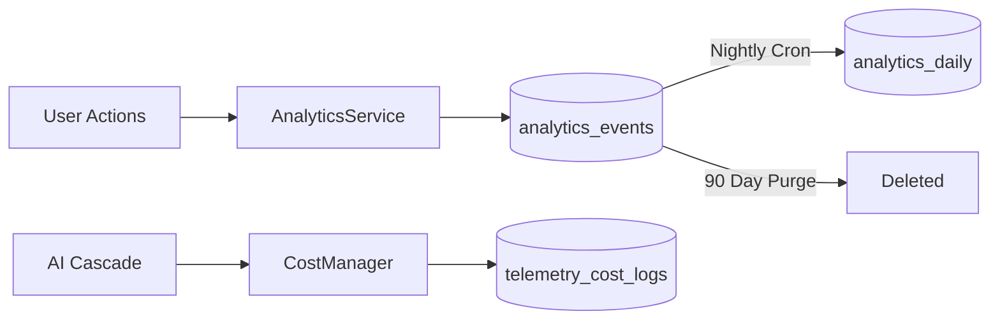

# Chapter 7: Product Analytics & System Telemetry

## 1. Introduction
Analytics track whether Recall is useful, fast, reliable, and improving. Unlike application logging, which is ephemeral and designed for debugging, analytics and telemetry provide durable, aggregated metrics on product usage (DAU, retention), AI performance (latencies, token costs), and system health. This chapter details the database structures and retention policies for managing this telemetry without compromising user privacy.

## 2. Current Recall implementation
Recall tracks telemetry primarily through two mechanisms:
1.  **AI Telemetry:** The `CostManager` logs token usage, audio duration, and USD costs into the `telemetry_cost_logs` PostgreSQL table.
2.  **In-Memory Aggregation:** The `PromptAnalyticsManager` aggregates metrics globally into in-memory dictionaries, serving them via the `/metrics` API.

## 3. Problems
*   **In-Memory Data Loss:** `PromptAnalyticsManager` loses all historical aggregated data whenever the Fast-API worker restarts.
*   **Global Telemetry Leak:** The `/metrics` endpoint currently returns global system-wide token usage to any authenticated user, failing to isolate data by `user_id`.
*   **Execution Bypasses:** The core summary pipeline currently bypasses the `CostManager` database write, meaning the most expensive operations in the system are not financially tracked.
*   **No Product Analytics:** While AI telemetry exists, product actions (searches performed, items saved, quizzes taken) are not systematically tracked in a durable table.

## 4. Design Goals
*   **Durable Analytics:** Store all telemetry in PostgreSQL. Relying on in-memory structures is prohibited.
*   **Cost Visibility:** Every single LLM execution, regardless of the pipeline, must be tracked for tokens and USD costs.
*   **Strict Isolation:** Telemetry queries must be partitioned by `user_id`. Global admin metrics require a separate, locked-down admin route.
*   **Lifecycle Management:** Raw events should be aggregated and purged after 90 days to minimize database bloat.

## 5. Architecture
1.  **Event Tracker:** A lightweight service pushes structured events (e.g., `item_saved`, `search_performed`) into an `analytics_events` table.
2.  **Cost Manager:** Hooked into the AI Cascade `EventBus`, it writes every `LLMRequestFinished` event into `telemetry_cost_logs`.
3.  **Aggregation Cron:** An APScheduler job runs nightly, rolling up raw `analytics_events` into an `analytics_daily` summary table, and purging raw rows older than 90 days.

## 6. Data Flow
1.  User performs a search.
2.  `SearchService` triggers `AnalyticsService.track("search_performed", user_id, {"latency_ms": 120, "results": 5})`.
3.  The event is asynchronously inserted into `analytics_events`.
4.  Concurrently, the AI Cascade processes a RAG summary. The provider returns usage statistics (150 prompt tokens, 50 completion tokens).
5.  `CostManager` computes the cost (`$0.0001`) and writes to `telemetry_cost_logs`.
6.  At midnight, the scheduler aggregates all "search_performed" events into a single daily row for that user.

## 7. Diagrams



## 8. Interfaces
*   **Analytics Tracking Interface:**
    ```python
    class AnalyticsService:
        async def track(self, event_name: str, user_id: int, metadata: dict = None):
            # Async DB insert to analytics_events
            pass
    ```

## 9. Database Changes
*   **New Tables:** `analytics_events` (id, user_id, event_name, metadata, created_at) and `analytics_daily` (id, user_id, date, event_name, count).
*   `telemetry_cost_logs` is correctly structured but needs to be actively populated by all pipelines.

## 10. Folder Structure
*   `backend/services/analytics/`: Tracking service and aggregation crons.
*   `backend/services/ai_cascade/telemetry/cost_manager.py`: Existing AI telemetry logger.

## 11. API Changes
*   Lock down `/metrics` behind an admin-only role check.
*   Create `/api/user/stats` to return user-specific, isolated usage metrics based on `user_id`.

## 12. Migration Strategy
1.  Update the `EventBus` listener in the AI Cascade to ensure all execution engines trigger the `CostManager` log write.
2.  Create the `analytics_events` table and wire up basic product actions (saves, searches, branch creations).
3.  Refactor `PromptAnalyticsManager` to pull from PostgreSQL rather than local memory.

## 13. Rollback Strategy
Analytics tracking is non-critical path. If the database insertions cause connection pool exhaustion, the `AnalyticsService` can be disabled via `TRACKING_ENABLED=false` without impacting core product functionality.

## 14. Performance
*   **Async Writes:** Analytics writes must be fully asynchronous. A failure to write an analytics event must never crash a user request.
*   **Aggregation:** Daily aggregations prevent the database from doing heavy `COUNT(*)` operations on millions of rows during dashboard loads.

## 15. Failure Modes
*   **Database Lock Contention:** High-velocity inserts could cause locking. If necessary, bulk inserts using queue-based batching can be adopted later.
*   **Missing Usage Data:** If an LLM provider fails to return `usage` metadata in its response, the `CostManager` must default to a heuristic token estimation rather than crashing.

## 16. Security Considerations
*   **Tenant Leakage:** The critical flaw in `/metrics` (exposing global stats) must be patched immediately.
*   **Metadata Safety:** The `metadata` JSONB column in `analytics_events` must never contain raw user text, passwords, or PII.

## 17. Complexity Analysis
*   **Time Complexity:** O(1) async write for event tracking. O(N) where N is the day's events for the nightly aggregation job.
*   **Space Complexity:** Bound by the 90-day retention policy. Aggregate tables scale indefinitely but linearly at O(Days).

## 18. Tradeoffs
*   **PostgreSQL vs. ClickHouse:** Using PostgreSQL for analytics is suboptimal at massive scale, but highly practical for V1. We trade long-term scalability for immediate operational simplicity.

## 19. Alternatives Considered
*   **PostHog / Mixpanel:** Rejected. While powerful, sending internal usage metrics to third-party services complicates the privacy policy. V1 relies on self-hosted PostgreSQL telemetry.

## 20. Final Recommendation
Build a lightweight, async telemetry logger backed by PostgreSQL. Ensure 100% coverage of AI cost logging across all cascade pipelines. Secure the metrics endpoints immediately.

## 21. Implementation Checklist
*   [ ] Refactor `/metrics` to enforce admin-only access or `user_id` filtering.
*   [ ] Hook `CostManager` up to the `ExecutionEngine` to ensure all pipelines are logged.
*   [ ] Create `analytics_events` table and aggregation cron job.
*   [ ] Delete the in-memory aggregation logic from `PromptAnalyticsManager`.

## 22. Future Improvements
*   Implement a dedicated OLAP database (like ClickHouse) if analytics event volume exceeds 10 million rows per month.
*   Add A/B testing cohort tracking to the analytics events.

## 23. Version
1.0.0

## 24. Priority
P2 - Medium (Critical for product iteration, but not core functionality)

## 25. Estimated Engineering Effort
4 Developer Days.
